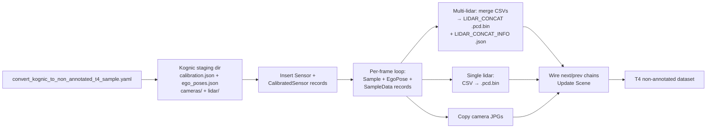
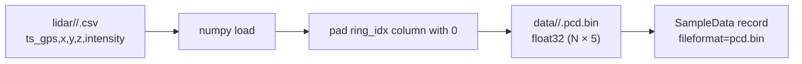
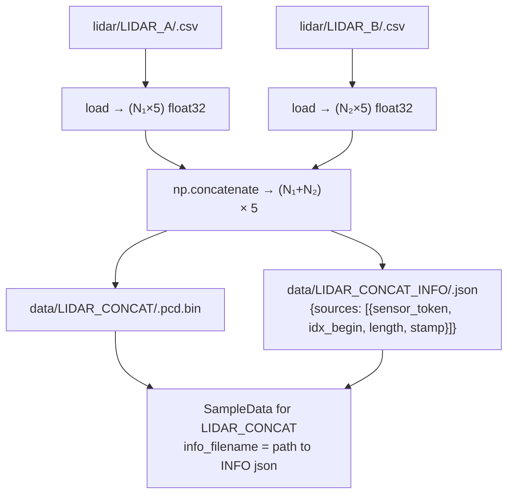

# Kognic to T4

This document explains how [kognic_to_t4_converter.py](../perception_dataset/kognic/kognic_to_t4_converter.py) reads a local Kognic staging directory and writes a T4 non-annotated dataset. It is the inverse of the [T4 → Kognic](tier_iv_t4_extractor_to_kognic.md) pipeline.

References:

- T4 format: [docs/t4_format_3d_detailed.md](t4_format_3d_detailed.md)
- Kognic staging format: [docs/tier_iv_t4_extractor_to_kognic.md](tier_iv_t4_extractor_to_kognic.md)

## Scope

The converter reads:

```text
<sequence_dir>/
  calibration.json
  ego_poses.json
  cameras/<channel>/<timestamp_ns>.jpg
  lidar/<channel>/<timestamp_ns>.csv
```

and writes:

```text
<out_dir>/
  annotation/
    sensor.json
    calibrated_sensor.json
    ego_pose.json
    sample.json
    sample_data.json
    scene.json
    log.json
    map.json
    attribute.json  category.json  instance.json
    sample_annotation.json  visibility.json   (empty)
  data/
    <channel>/
      000000.pcd.bin     (single lidar) or
      000000.jpg         (camera)
    LIDAR_CONCAT/
      000000.pcd.bin     (merged, only when multiple lidar sources)
    LIDAR_CONCAT_INFO/
      000000.json        (per-source slice index, only when multiple lidar sources)
```

## Usage

```bash
python -m perception_dataset.convert --config config/convert_kognic_to_non_annotated_t4_sample.yaml
```

Sample config:

```yaml
task: convert_kognic_to_non_annotated_t4
conversion:
  input_base: ./data/kognic_format
  output_base: ./data/non_annotated_t4_format
  scene_name: "" # optional override; defaults to the input directory name
```

`input_base` may be either a single Kognic sequence directory (containing `calibration.json`) or a parent directory that holds multiple sequence subdirectories. Each subdirectory that contains `calibration.json` and `ego_poses.json` is treated as one sequence.

## High-Level Flow



## Calibration Conversion

`calibration.json` is keyed by sensor name. The converter distinguishes cameras from LiDARs by the presence of a `camera_matrix` field.

### Cameras

| T4 field                              | Kognic source                                                |
| ------------------------------------- | ------------------------------------------------------------ |
| `sensor.channel`                      | Sensor name key in `calibration.json`                        |
| `sensor.modality`                     | `"camera"`                                                   |
| `calibrated_sensor.translation`       | `position.x/y/z`                                             |
| `calibrated_sensor.rotation`          | `rotation_quaternion.w/x/y/z`                                |
| `calibrated_sensor.camera_intrinsic`  | `[[fx, 0, cx], [0, fy, cy], [0, 0, 1]]` from `camera_matrix` |
| `calibrated_sensor.camera_distortion` | `[k1, k2, p1, p2, k3]` from `distortion_coefficients`        |

### LiDARs

LiDAR calibration entries have no `camera_matrix`. The `position` and `rotation_quaternion` are copied directly into `translation` and `rotation` in `calibrated_sensor.json`.

When multiple LiDAR channels are present, an extra `LIDAR_CONCAT` sensor record is inserted with identity calibration (`translation=[0,0,0]`, `rotation=[1,0,0,0]`). This matches T4 convention where `LIDAR_CONCAT` points are already in `base_link`.

## Ego Poses

`ego_poses.json` is keyed by frame index (as a string). Each entry has `position` and `rotation` in T0-normalized form (frame 0 is identity). The converter stores these as-is into `annotation/ego_pose.json`. The T4 `EgoPose.timestamp` is set to the LiDAR frame timestamp in microseconds.

## LiDAR Conversion

### Single LiDAR

When exactly one LiDAR channel is present in `calibration.json`, its CSV files are converted directly:



### Multiple LiDARs (LIDAR_CONCAT merge)

When two or more LiDAR channels are present, the converter merges all per-source CSVs into a single `LIDAR_CONCAT` binary and writes a `LIDAR_CONCAT_INFO` sidecar per frame:



The `LIDAR_CONCAT_INFO` format matches what `pointcloud.py` reads in the T4→Kognic direction:

```json
{
  "sources": [
    {
      "sensor_token": "<sensor.json token for LIDAR_A>",
      "idx_begin": 0,
      "length": 1200,
      "stamp": { "sec": 1754014709, "nanosec": 448765440 }
    },
    {
      "sensor_token": "<sensor.json token for LIDAR_B>",
      "idx_begin": 1200,
      "length": 800,
      "stamp": { "sec": 1754014709, "nanosec": 498765440 }
    }
  ]
}
```

The `sensor_token` values correspond to the `sensor.json` entries created for each individual LiDAR channel.

### Point-Cloud Binary Layout

Both paths write float32 arrays with `LIDAR_CONCAT_NUM_POINT_FEATURES = 5` columns:

| Column index | Meaning                  |
| ------------ | ------------------------ |
| 0            | x (metres, base_link)    |
| 1            | y (metres, base_link)    |
| 2            | z (metres, base_link)    |
| 3            | intensity                |
| 4            | ring_idx (always 0 here) |

The `ring_idx` column is present to match the T4 binary layout but carries no meaningful value in this converter.

## Camera Conversion

Camera images are copied from `cameras/<channel>/<timestamp_ns>.jpg` to `data/<channel>/<frame_idx:06d>.jpg`. The destination timestamp used for the `SampleData` record is the filename timestamp in nanoseconds converted to microseconds.

## T4 Table Chain

After inserting all sensor and frame records, the converter:

1. Sets `next`/`prev` on consecutive `Sample` records.
2. Sets `next`/`prev` on consecutive `SampleData` records within each channel.
3. Updates `Scene.nbr_samples`, `Scene.first_sample_token`, and `Scene.last_sample_token`.
4. Saves all `TableHandler` instances to `annotation/`.

The following annotation tables are created but left empty (no annotations are present in Kognic staging format):

- `attribute.json`
- `category.json`
- `instance.json`
- `sample_annotation.json`
- `visibility.json`

## Timestamps

| Value                  | Unit         | Conversion                  |
| ---------------------- | ------------ | --------------------------- |
| Kognic CSV filename    | nanoseconds  | `// 1000` → T4 microseconds |
| `EgoPose.timestamp`    | microseconds | From LiDAR CSV filename     |
| `Sample.timestamp`     | microseconds | Same as `EgoPose.timestamp` |
| `SampleData.timestamp` | microseconds | From image/lidar filename   |

If no LiDAR CSV is found for a frame, the frame timestamp falls back to `frame_index × 100_000 µs`.

## Failure Modes and Assumptions

| Case                                             | Behavior                                                                                                      |
| ------------------------------------------------ | ------------------------------------------------------------------------------------------------------------- |
| Input directory has no `calibration.json`        | Sequence is skipped.                                                                                          |
| LiDAR CSV missing for a frame                    | No `SampleData` is inserted for that lidar channel in that frame.                                             |
| Camera image missing for a frame                 | No `SampleData` is inserted for that camera in that frame.                                                    |
| LiDAR CSV has zero rows                          | An empty `.pcd.bin` is written; `LIDAR_CONCAT_INFO` records `length=0`.                                       |
| Frame count differs across lidar/camera channels | Shorter channels produce fewer `SampleData` records; chain is wired correctly for each channel independently. |
