# T4 format 3D data

**T4 format**, which is based on nuScenes and nuImages format, is the dataset format used in TIER IV.  
**T4 non-annotated format** is the dataset format that annotated files are empty. (attribute, category, instance, sample_annotation, visibility)

## version

- (2021.07.08) T4 format ver1.0: Make initial T4 format confirmed to Nuscenes + nuImages format
- (2021.11.30) T4 format ver1.1: Updated format to make it available in ADP
- (2022.06.03) T4 format ver1.2: Update topics contained in input_bag. Add status.json. Remove occlusion_state in attribute, write to visibility.json
- (2022.07.26) T4 format ver1.2: Add a topic contained in input_bag.
- (2024.07.24) T4 Format ver1.3: Added optional values for the T4 format, which are used in the Co-MLOps dataset format.
- (2025.05.20) T4 Format ver1.4: Introduced traffic light-specific annotation fields and clarified the handling of auto-generated annotations.

## Dataset Sample

You can download one sample T4 format dataset manually from [here](https://drive.google.com/file/d/1UjMWZj5Yc55O7BZiGHa0ikZGhwmcfPiS/view).  
For this sample, the directory named "sample_dataset" corresponds to the "T4 dataset ID" described in the following section.  
Note: This sample dataset contains only lidar point cloud sensor data and includes annotations.

## Directory Structure

- {T4 dataset ID}/
  - map/
    - lanelet2_map.osm
    - pointcloud_map.pcd
  - status.json
  - annotation/
    - attribute.json
    - calibrated_sensor.json
    - category.json
    - ego_pose.json
    - instance.json
    - log.json
    - map.json
    - sample.json
    - sample_annotation.json
    - sample_data.json
    - scene.json
    - sensor.json
    - visibility.json
    - vehicle_state.json (Optional; Necessary for Co-MLOps dataset)
    - object_ann.json (If 2D annotation exists)
    - surface_ann.json (If 2D annotation exists)
  - data/
    - /LIDAR_CONCAT
      - 0.pcd.bin (point cloud [x, y, z, intensity, ring_idx])
      - 1.pcd.bin
      - {frame_id}.pcd.bin
    - /RADAR_FRONT
      - 0.pcd.bin (fields [x, y, z, class, id, rcs, vx, vy, vx_comp, vy_comp, is_quality_valid, ambiguity_state, x_rms, y_rms, invalid_state, confidence, vx_rms, vy_rms])
      - {frame_id}.pcd.bin
      - 0.json (fields [x, y, z, velocity, acceleration, size, uuid, class])
      - {frame_id}.json
    - /RADAR_FRONT_LEFT
    - /RADAR_FRONT_RIGHT
    - /RADAR_BACK_LEFT
    - /RADAR_BACK_RIGHT
    - /CAM_FRONT (If exists)
      - 0.png
      - 1.png
      - {frame_id}.png
    - /CAM_FRONT_LEFT (If exists)
    - /CAM_FRONT_RIGHT (If exists)
    - /CAM_BACK (If exists)
    - /CAM_BACK_LEFT (If exists)
    - /CAM_BACK_RIGHT (If exists)
    - /CAM_FRONT_WIDE (If exists)
    - /CAM_FRONT_NARROW (If exists)
    - /CAM_TRAFFIC_LIGHT_NEAR (If exists)
    - /CAM_TRAFFIC_LIGHT_FAR (If exists)
  - input_bag/
    - {rosbag-name}.db3/{rosbag-name}.mcap
    - metadata.yaml

## coordinate system



## Data

### Point cloud format

- directory
  - Directory name must be either `LIDAR_CONCAT` or `LIDAR_TOP`

```plaintext
- /data
  - /LIDAR_CONCAT
    - 0.pcd.bin (point cloud [x, y, z, intensity, ring_idx])
    - 1.pcd.bin
    - {frame_id}.pcd.bin
```

`.pcd.bin` files are originally `numpy.ndarray` `(N, 5)`.

Each record means `[x, y, z, intensity, ring_idx(=-1)]`. **x, y, z are given with respect to its base_link**

`ring_idx` is not used any more.

`.pcd.bin` data should be loaded as follows:

```python
# shape (N*5, )
pcd_data = np.fromfile(path_to_pcd_bin, dtype=np.float32)
# shape (N, 5)
pcd_data = pcd_data.reshape(-1, 5)
```

### Radar object

- directory

```plaintext
- /data
  - /RADAR_FRONT
    - 0.pcd
    - {frame_id}.pcd
    - 0.json
    - {frame_id}.json
  - /RADAR_FRONT_LEFT
  - /RADAR_FRONT_RIGHT
  - /RADAR_BACK_LEFT
  - /RADAR_BACK_RIGHT
```

Radar data contains with `.pcd` or `.json` format.

- `.pcd` format

This is based on NuScenes radar data format. The following is an example of the header fields.
For the details, see [nuscenes-devkit](https://github.com/nutonomy/nuscenes-devkit/blob/a5c089133baa001d3ab3c5583a103957e4ae8375/python-sdk/nuscenes/utils/data_classes.py#L298).

```yaml
# .PCD v0.7 - Point Cloud Data file format
VERSION 0.7
FIELDS x y z dyn_prop id rcs vx vy vx_comp vy_comp is_quality_valid ambig_state x_rms y_rms invalid_state pdh0 vx_rms vy_rms
SIZE 4 4 4 1 2 4 4 4 4 4 1 1 1 1 1 1 1 1
TYPE F F F I I F F F F F I I I I I I I I
COUNT 1 1 1 1 1 1 1 1 1 1 1 1 1 1 1 1 1 1
WIDTH 112
HEIGHT 1
VIEWPOINT 0 0 0 1 0 0 0
POINTS 112
DATA binary
```

- `.json` format

This is formatted radar object data into json. The following is field of each data.

```yaml
translation ([float; 3]): x, y, z coordinates of the centroid of the object being tracked.
velocity ([float; 3]): The velocity of the object in each spatial dimension.
acceleration ([float; 3]): The acceleration of the object in each spatial dimension.
size ([float; 3]): The object size in the sensor frame, which is (length, width, height) order.
classification (int): Object classification. NO_CLASSIFICATION=0, STATIC=1, DYNAMIC=2.
uuid (str): A unique ID of the object generated by the radar.
```

### Image data

- Make data directory from each camera
  - data: png or jpeg format
- For example, aip_xx1 have 8 cameras
  - Camera for dynamic object recognition (front, front left, front right, back, back left, back right)
  - Camera for traffic light recognition (near, far)

```plaintext
- /data
  - /CAM_FRONT
    - 0.png
    - 1.png
    - {frame_id}.png
  - /CAM_FRONT_LEFT
  - /CAM_FRONT_RIGHT
  - /CAM_BACK
  - /CAM_BACK_LEFT
  - /CAM_BACK_RIGHT
  - /CAM_FRONT_WIDE
  - /CAM_FRONT_NARROW
  - /CAM_TRAFFIC_LIGHT_NEAR
  - /CAM_TRAFFIC_LIGHT_FAR
```

### Map data

- Push lanelet2_map.osm (vector map) and pointcloud_map.pcd (pointcloud map) to dataset server
  - Use with rosbag evaluation

```yaml
- maps/
  - lanelet2_map.osm
  - pointcloud_map.pcd
```

- (In the future) In data augmentation layer, rasterize vector map to use train 3d detection model

### status.json

- status.json is under construction
- Data(WIP)
  - Environment data at collecting rosbag
    - time
    - place
    - weather
  - Annotation
    - annotation person
    - tool or outsourcing

### Input bag

- input_bag is the ros2 bag file generates this whole dataset.
- This ros2 bag file MUST contain only topics below
  - `/localization/kinematic_state` is necessary for Obstacle Segmentation Evaluation.

```text
/sensing/camera/camera{CAMERA_ID}/image_rect_color/compressed
/sensing/camera/camera{CAMERA_ID}/camera_info
/sensing/gnss/{GNSS_VENDOR}/nav_sat_fix
/sensing/imu/{IMU_VENDOR}/imu_raw
/sensing/lidar/{LIDAR_POSITION}/{LIDAR_VENDOR}_packets
/sensing/lidar/concatenated/pointcloud
/sensing/radar/{RADAR_POSITION}/objects_raw
/{VEHICLE_NAME}/from_can_bus
/tf
/tf_static
/localization/kinematic_state
/vehicle/status/velocity_status

# optional
Raw GNSS sensor data from vendor e.g. /sensing/gnss/ublox/navpvt, /sensing/gnss/septentrio/pvtgeodetic
```

## 3d detection annotation format

- Almost equivalent to the [nuScenes format](https://www.nuscenes.org/nuscenes#data-format).
- The [official tutorial notebook](https://www.nuscenes.org/nuscenes#tutorials) will help you get familiar with it.


from [the official site](https://www.nuscenes.org/nuscenes#data-format).

### Overview on availability of json files

| File                   |       Availability\* |
| :--------------------- | -------------------: |
| attribute.json         |           completely |
| calibrated_sensor.json |   completely + added |
| category.json          |            partially |
| ego_pose.json          | completely + changed |
| instance.json          |           completely |
| log.json               |           dummy file |
| map.json               |           dummy file |
| sample.json            |           completely |
| sample_annotation.json |            partially |
| sample_data.json       |            partially |
| scene.json             |            partially |
| sensor.json            |           completely |
| visibility.json        |           completely |

Availability:

- completely: the same format as that of nuScenes
- partially: lacks of one or more items compared to nuScenes
- added: one or more items are newly added
- changed: one or more items are changed
- dummy file: the file exists, but the contents are empty.

### attribute.json

#### Description

An attribute is a property of an instance that can change while the category remains the same.
e.g.:

- pedestrian
  - sitting
  - standing
  - lying_down

#### Items

- attribute
  - "token": <str> -- Unique record identifier.
  - "name": <str> -- Attribute name.
  - "description": <str> -- Attribute description.

### calibrated_sensor.json

#### Description

Definition of a particular sensor (lidar, camera) as calibrated on a particular vehicle. All extrinsic parameters are given with respect to ~~the ego vehicle body frame~~ the world origin. Although the distortion parameters (k1, k2, p1, p2, k3) are given, but
its calibration is not done. So, if cameras used in collecting the data have any distortion, it is responsible for you to consider the parameters.

#### Caution

- Currently, this converter does not consider the calibration of distortion.
  Camera distortion parameters (k1, k2, p1, p2, k3) are temporarily stored in calibrated_sensor.json.
  **As long as there is no distortion, there is no problem. If not, it does not work correctly for now.**
- While all extrinsic parameters are given with respect to the ego vehicle body frame in the original nuScenes dataset, they are given with respect to **the world coordinate** in this format for now because the information about ego pose is not available.
- The translation and rotation in a record of LiDAR data are equals to those of the base_link.

#### Items

- calibrated_sensor
  - "token": [str] -- Unique record identifier.
  - "sensor_token": [str] -- Foreign key pointing to the sensor type.
  - "translation": [float] [3] -- Coordinate system origin in meters: (x, y, z).
  - "rotation": [float] [4] -- Coordinate system orientation as - quaternion: (w, x, y, z).
  - "camera_intrinsic": [float] [3, 3] -- Intrinsic camera calibration. Empty list `[]` for sensors other than cameras.
  - "camera_distortion": [float] [5] -- Distortion parameters (k1, k2, p1, p2, k3) Empty list '[]' for sensors other than cameras. **(Added)**

### category.json

#### Description

Taxonomy of object categories (e.g. vehicle.truck, vehicle.car, pedestrian.adult).

#### Caution

The item "description" for the category is not implemented for now.

#### Items

- category
  - "token": [str] -- Unique record identifier.
  - "name": [str] -- Category name. The latest format is "class" (e.g. car, truck), but "category.class" format (e.g. vehicle.car) is also supported.
  - "description": [str] -- Category description. Empty string `""` for now. **(Not available)**
  - "index": [int] -- Category index, this is added to support lidarseg, or None when it doesn't support lidarseg
  - "has_orientation": [bool] -- Set to `true` if objects of this category may include an `orientation` field in their annotations (e.g., traffic light arrows). **(Added)**
  - "has_number": [bool] -- Set to `true` if objects of this category may include a `number` field in their annotations (e.g., numeric traffic lights). **(Added)**

For t4 format, "name" should be one of the following:

- car
- police_car
- fire_truck
- ambulance
- motorcycle
- trailer
- truck
- bicycle
- bus
- forklift
- pedestrian
- construction_worker
- personal_mobility
- police_officer
- stroller
- wheelchair
- animal

For traffic light, "name" should be "color"_"shape" format, where color and shape are placeholders representing the light’s color and its shape, respectively.
e.g. "red_circle", "green_arrow", "yellow_circle", "red_number", "green_pedestrian", "red_cross".

### ego_pose.json

#### Description

Ego_pose represents the pose of the ego vehicle at a specific timestamp.  
This includes both the vehicle's position and orientation in space, typically referenced in a global coordinate system such as the map or odometry frame.  
The concept is based on [nuScenes](https://arxiv.org/pdf/1903.11027) and [nuPlan](https://nuplan-devkit.readthedocs.io/en/latest/nuplan_schema.html#ego-pose).

#### Recording Options

There are 2 options to retrieve the corresponding ego pose record, which are using `/tf` or INS message.

Note that during recording, each record is result in interpolating at the timestamp corresponding to the particular sensor data.

##### With `/tf` message

In this option, it is assumed that input RosBag contains `/tf` message.

> [!WARNING]
> This option does not record `velocity`, `acceleration` and `geocoordinate` fields.

In order to enable to create ego pose records using `/tf` message, set `with_ins: false` in your configuration:

```yaml
task: convert_rosbag2_to_non_annotated_t4
description:
  scene: ""
conversion:
  ...
  with_ins: false # use `/tf` message
  ...
```

##### With INS messages

In this option, it is assumed that input RosBag contains following messages, which are related to INS.

|          Topic          |            Type             | Description                                                          |
| :---------------------: | :-------------------------: | -------------------------------------------------------------------- |
|  `/ins/oxts/odometry`   |   `nav_msgs/msg/Odometry`   | An estimate of a position and velocity in free space.                |
|     `/ins/oxts/imu`     |    `sensor_msgs/msg/Imu`    | An IMU (Internal Measurement Unit) data.                             |
| `/ins/oxts/nav_sat_fix` | `sensor_msgs/msg/NavSatFix` | Navigation Satellite fix for any Global Navigation Satellite System. |

In order to enable to create ego pose records using INS message, set `with_ins: true` in your configuration:

```yaml
task: convert_rosbag2_to_non_annotated_t4
description:
  scene: ""
conversion:
  ...
  with_ins: true # use INS messages
  ...
```

#### Items

- ego_pose
  - "token": [str] -- Unique record identifier.
  - "translation": [float] [3] -- Position of the ego vehicle in the odometry or map coordinate system (in meters): x, y, z.
  - "rotation": [float] [4] -- Quaternion representing the orientation of the ego vehicle in the odometry or map coordinate system: w, x, y, z.
  - "timestamp": [int] -- Unix time stamp (μ sec).
  - "twist": [Optional[float]] [6] -- Linear and angular velocities in the **local** coordinate system of the ego vehicle (in m/s for linear and rad/sec for angular): (vel_x, vel_y, vel_z, yaw_rate, pitch_rate, roll_rate). **(Added)**
  - "acceleration": [Optional[float]] [3] -- Acceleration in the **local** coordinate system of the ego vehicle (in m/s²): (ax, ay, az). **(Added)**
  - "geocoordinate": [Optional[float]] [3] -- Coordinates in the WGS 84 reference ellipsoid (latitude, longitude, altitude) in degrees and meters. **(Added)**

### instance.json

#### Description

A particular object instance. This table is an enumeration of all object instances we observed. Note that instances are not tracked across scenes (i.e., even if A == B, instance A in scene01 and instanceB in scene02 can be treated as different instances.)

e.g.:

- Frame: t
  - Category: Car
    - car01 (instance)
    - car02 (instance)
    - car03 (instance)
- Frame: t+1
  - Category: Car
    - car01 (instance)
    - car02 (instance)
    - ~~car03 (instance)~~ (not appears because car03 went out of sight)

#### Items

- instance
  - "token": [str] -- Unique record identifier.
  - "category_token": [str] -- Foreign key pointing to the category of the instance.
  - "instance_name": [str] -- Dataset Name + Instance ID defined in annotation tool.
  - "nbr_annotations": [int] -- Number of annotations of this instance.
  - "first_annotation_token": [str] -- Foreign key. Points to the first annotation of this instance.
  - "last_annotation_token": [str] -- Foreign key. Points to the last annotation of - this instance.

### log.json

#### Description

Log information on the data from which the data was extracted.

#### Caution

logfile, vehicle, date_captured, location is not provided for now.
This information, or the same kind of one, will be stored in collecting_collection.yml.

#### Items

- log
  - "token": [str] -- Unique record identifier.
  - "logfile": [str] -- path to logfile. **(Not available)**
  - "vehicle": [str] -- Vehicle name e.g., `jpn-taxi`. **(Not available)**
  - "date_captured": [str] -- Date (YEAR-MONTH-DAY-HOUR-MIN-SEC). e.g. `2020-08-29-09-30-13` **(Not available)**
  - "location": [str] -- Area where log was captured. **(Not available)**

### map.json

- Now map.json is **Dummy File**

#### Caution

map.json or map data currently is not output. Since map.json and map data will be used in tasks like tracking and prediction, it will be implemented shortly.

Items related to maps can be extracted from data submitted to Scale_AI for annotation. How to update these processes is **under consideration**.

#### Description

> Map data that is stored as binary semantic masks from a top-down view.
> <cite><https://www.nuscenes.org/nuscenes#data-format><cite>

#### Items

- map
  - "token": [str] -- Unique record identifier.
  - "log_tokens": [str] [n] -- Foreign keys.
  - "category": [str] -- Map category, currently only semantic_prior for drivable surface and sidewalk.
  - "filename": [str] -- Relative path to the file with the map mask.

### sample.json

#### Description

A sample is an annotated keyframe. The timestamp of a sample is the same as that of a LiDAR sample data.

#### Items

- sample
  - "token": [str] -- Unique record identifier.
  - "timestamp": [int] -- Unix time stamp (μ sec). (= 'timestamp' in a LiDAR sample data)
  - "scene_token": [str] -- Foreign key pointing to the scene.
  - "next": [str] -- Foreign key. Sample that follows this in time. Empty if end of scene.
  - "prev": [str] -- Foreign key. Sample that precedes this in time. Empty if start of scene.

### sample_annotation.json

#### Description

An annotation for objects in a sample. All location data is given with respect to **the global coordinate system**.

#### Items

- sample_annotation
  - "token": [str] -- Unique record identifier.
  - "sample_token": [str] -- Foreign key. NOTE: this points to a sample NOT a sample_data since annotations are done on the sample level taking all relevant sample_data into account.
  - "instance_token": [str] -- Foreign key. Which object instance is this annotating. An instance can have multiple annotations over time.
  - "attribute_tokens": [str] [n] -- Foreign keys. List of attributes for this annotation. Attributes can change over time.
  - "visibility_token": [str] -- Foreign key. Visibility may also change over time. If no visibility is annotated, the token is an empty string.
  - "translation": [float] [3] -- The center location of bounding box in meters as (center_x, center_y, center_z) in the odometry or map coordinate system.
  - "velocity": [float] [3] -- Bounding box velocity in meter per seconds as (velocity_x, velocity_y, velocity_z).
  - "acceleration": [float] [3] -- Bounding box acceleration as (acceleration_x, acceleration_y, acceleration_z).
  - "size": [float] [3] -- Bounding box size in meters as (width, length, height).
  - "rotation": [float] [4] -- Bounding box orientation as quaternion in the odometry or map coordinate system: w, x, y, z.
  - "num_lidar_pts": [int] -- Number of lidar points in this box. Points are counted during the lidar sweep identified with this sample.
  - "num_radar_pts": [int] -- Number of radar points in this box. Points are counted during the radar sweep identified with this sample. This number is summed across all radar sensors without any invalid point filtering. **(fixed to `0`)**
  - "automatic_annotation": [bool] -- True if the annotation is fully generated by an ML model; False if any part is manually modified or annotated. **(Added)**
  - "next": [str] -- Foreign key. Sample annotation from the same object instance that follows this in time. Empty string `""`if this is the last annotation for this object.
  - "prev": [str] -- Foreign key. Sample annotation from the same object instance that precedes this in time. Empty string `""` if this is the first annotation for this object.

### sample_data.json

#### Description

A sensor data e.g. image, point cloud or radar return. For sample_data with is_key_frame=True, the time-stamps should be very close to the sample it points to. For non key-frames the sample_data points to the sample that follows closest in time.

#### Caution

- 'is_key_frame': For sample_data with is_key_frame=True, the time-stamps should be very close to the sample it points to. For non key-frames the sample_data points to the sample that follows closest in time.
  - this feature is not yet implemented.

#### Items

- sample_data
  - "token": [str] -- Unique record identifier.
  - "sample_token": [str] -- Foreign key. Sample to which this sample_data is associated.
  - "ego_pose_token" : [str] -- Foreign key.
  - "calibrated_sensor_token": [str] -- Foreign key.
  - "filename": [str] -- Relative path from a dataset root directory to a file.
  - "fileformat": [str] -- Data file format. (e.g., png, pcd.bin)
  - "width": [int] -- If the sample data is an image, this is the image width in pixels.
  - "height": [int] -- If the sample data is an image, this is the image height in pixels.
  - "timestamp": [int] -- Unix time stamp (μ sec).
  - "is_key_frame" : [bool] -- True if sample_data is part of key_frame, else False.
  - "next": [str] -- Foreign key. Sample data from the same sensor that follows this in time. Empty if end of scene.
  - "prev": [str] -- Foreign key. Sample data from the same sensor that precedes this in time. Empty if start of scene.
  - "is_valid": [bool] -- True if the data is valid, else False. Invalid data should be ignored.

### scene.json

#### Description

A scene is a sequence of consecutive frames extracted from a log. In TIER IV format, only one scene is included in a single dataset.
(scene > sample(=frame) > annotation)

#### Caution

- name: scene name is defined as "{PROJECT_NAME}\_{SCENE_TOKEN}". If the scene name is provided by other files, it should be replaced.
- description: not provided for now.

#### Items

- scene
  - "token": [str] -- Unique record identifier.
  - "name" : [str] -- Short string identifier. Defined as `{project_name}_{scene_token}`.
  - "description": [str] -- description of the scene.
  - "log_token": [str] -- Foreign key. Points to log from where the data was extracted.
  - "nbr_samples": [int] -- Number of samples in this scene.
  - "first_sample_token": [str] -- Foreign key. Points to the first sample in scene.
  - "last_sample_token": [str] -- Foreign key. Points to the last sample in scene.

### sensor.json

No change here.

#### Description

A description of sensor types.

#### Items

- sensor
  - "token": [str] -- Unique record identifier.
  - "channel": [str] -- Sensor channel name.
  - "modality": [str] {camera, lidar, radar} -- Sensor modality.

### visibility.json

A description of sensor occlusion status.

#### Description

The visibility of an instance is the fraction of annotation visible in all 6 images.
Default visibility binned into 4 bins:

- 1: 0% ~ 40%
- 2: 40% ~ 60%
- 3: 60% ~ 80%
- 4: 80% ~ 100%

For T4 annotated dataset, visibility is classified into 4 bins below:

- 1: full: "No occlusion of the object."
- 2: most: "Object is occluded, but by less than 50%."
- 3: partial: "The object is occluded by more than 50% (but not completely)."
- 4: none: "The object is 90-100% occluded and no points/pixels are visible in the label."

**Note that this annotation is not sensitive to boundaries.**

#### Items

- visibility
  - "token": [str] -- Unique record identifier.
  - "level": [str] -- Visibility level.
  - "description": [str] -- Description of visibility level.

### vehicle_state.json

A description of vehicle status.

#### Description

The vehicle_state.json file is an optional component of the T4 dataset format, necessary for the Co-MLOps dataset.  
This file provides comprehensive information about the vehicle's state at a given timestamp, including the status of doors, indicators, steering data, and other relevant information.

#### Items

- vehicle_state
  - "token": [str] -- Unique record identifier.
  - "timestamp": [int] -- Unix time stamp (μ sec).
  - "accel_pedal": [Optional[float]] -- Accel pedal position [%]
  - "brake_pedal": [Optional[float]] -- Brake pedal position [%]
  - "steer_pedal": [Optional[float]] -- Steering wheel position [%]
  - "steering_tire_angle": [Optional[float]] -- Steering tire angle [rad]
  - "steering_wheel_angle": [Optional[float]] -- steering wheel angle [rad]
  - "shift_state": [Optional[str]] {PARK, REVERSE, NEUTRAL, HIGH, FORWARD, LOW, NONE} -- Shift state.
  - "indicators": [Optional[str]] [3]
    - "left": [Optional[str]] -- State of the left indicator ("on" or "off").
    - "right": [Optional[str]] -- State of the right indicator ("on" or "off").
    - "hazard": [Optional[str]] -- State of the hazard lights ("on" or "off").
  - "additional_info":
    - "speed": [Optional[float]] -- Speed of the vehicle in km/h.

### Reference

- nuScenes: <https://www.nuscenes.org/nuscenes#data-format>

## 2d detection annotation format with what differs from nuImages

```yaml
- annotation/
  - object_ann.json
  - surface_ann.json
```

### 2D annotation format in T4 format

The T4 dataset format is built upon the nuImages format, with a significant enhancement: the inclusion of an instance_token.

The instance_token is a unique identifier assigned to each object instance, allowing for precise tracking and differentiation of individual objects across the dataset. This enhancement facilitates tasks such as object detection, instance segmentation, and tracking, making the T4 dataset particularly valuable for advanced computer vision applications.

- **_Almost_** Equivalent to the [nuImages format](https://www.nuscenes.org/nuimages).
  - Annotation attribute may be updated frequently.
  - `instance_token`, `orientation`, `number`, `automatic_annotation` are added to the annotation format.
- object_ann.json: The annotation of a foreground object (car, bike, pedestrian) in an image. Each foreground object is annotated with a 2d box, a 2d instance mask and category-specific attributes.

```json
[
  {
    "token":                  <str> -- Unique record identifier.
    "sample_data_token":      <str> -- Foreign key pointing to the sample data, which must be a keyframe image.
    "instance_token":         <str> -- Foreign key. Which object instance is this annotating. This token includes same token in corresponding sample_annotation.json.
    "category_token":         <str> -- Foreign key pointing to the object category.
    "attribute_tokens":       <str> [n] -- Foreign keys. List of attributes for this annotation.
    "bbox":                   <int> [4] -- Annotated amodal bounding box. Given as [xmin, ymin, xmax, ymax].
    "mask":                   <RLE> -- Run length encoding of instance mask using the pycocotools package.
    "orientation":            <float> -- Orientation of the arrow shape within the bounding box, in radians. Used only for traffic light arrows.
    "number":                 <int> -- The digit displayed within the bounding box. Used only for numeric traffic lights.
    "automatic_annotation":   <bool> -- Set to True if the annotation is generated entirely by an ML model. Set to False if at least one part of the annotation (either bbox or mask) is manually modified or annotated.
  }
]
```

- surface_ann.json: The annotation of a background object (driveable surface) in an image. Each background object is annotated with a 2d semantic segmentation mask.

```json
[
  {
    "token":                  <str> -- Unique record identifier.
    "sample_data_token":      <str> -- Foreign key pointing to the sample data, which must be a keyframe image.
    "category_token":         <str> -- Foreign key pointing to the surface category.
    "mask":                   <RLE> -- Run length encoding of segmentation mask using the pycocotools package.
    "automatic_annotation":   <bool> -- True if the annotation is fully generated by an ML model; False if any part is manually modified or annotated.
  }
]
```

### 3D lidarseg annotation format in T4 format

- T4 dataset of 3D lidarseg annotation is built upon on 3d detection of T4 dataset, the format is exactly same to [nuScenes format](https://www.nuscenes.org/nuscenes#data-format) with one additional `lidarseg.json` and lidarseg bin folder: `lidarseg/annotation/<lidarseg_token>.bin`.
- Note that every `<lidarseg_token>.bin` consists of category index for every lidar pointcloud in a keyframe

- lidarseg.json: The annotation of lidarseg for a sample data. Each record represents annotatiosn for a sample data record in T4 dataset

```json
[
 {
  "token":                <str> -- Unique record identifier.
  "sample_data_token":    <str> -- Foreign key pointing to the sample data, which must be a keyframe image.
  "filename":             <str> -- The name of the .bin files containing the lidarseg labels. These are numpy arrays of uint8 stored in binary format using numpy.
 }
]
```
