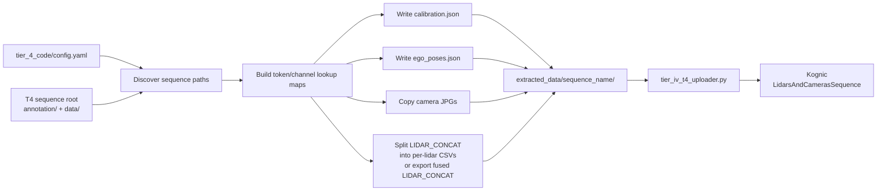
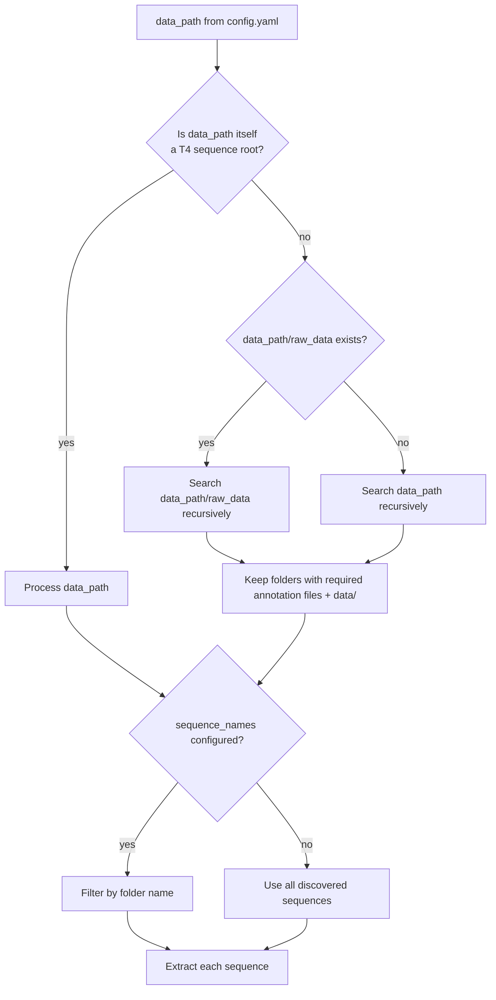
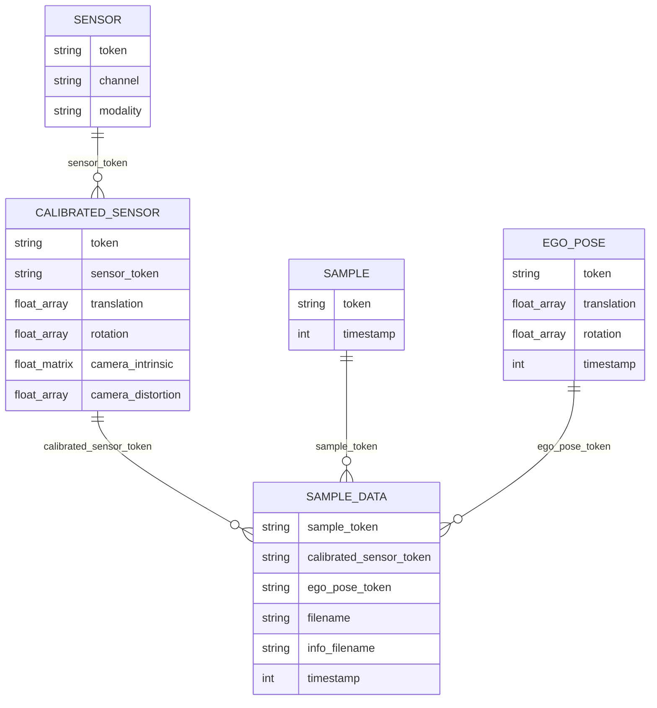
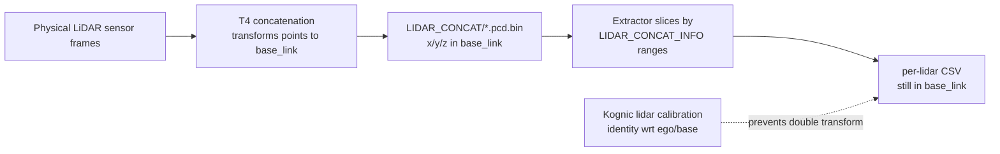
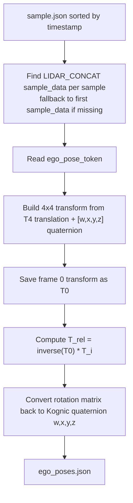
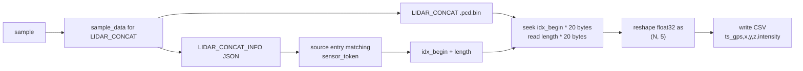
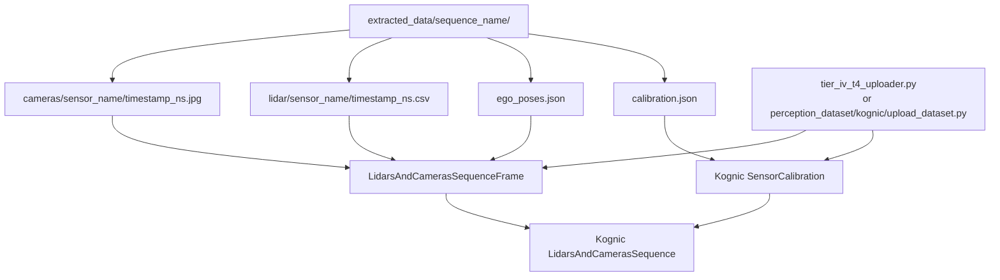

# Tier IV T4 Extractor to Kognic

This document explains how [tier_iv_t4_extractor.py](../tier_4_code/tier_iv_t4_extractor.py) reads a Tier IV T4 sequence and reshapes it into the extracted data layout consumed by [tier_iv_t4_uploader.py](../tier_4_code/tier_iv_t4_uploader.py) for Kognic upload.

References:

- T4 format: [docs/t4_format_3d_detailed.md](t4_format_3d_detailed.md)
- Kognic supported file formats: <https://docs.kognic.com/api-guide/supported-file-formats>
- Kognic calibration overview: <https://docs.kognic.com/api-guide/calibrations-overview>

## Scope

The extractor creates a Kognic-ready local staging format for the Kognic IO uploader:

```text
extracted_data/<sequence_name>/
  calibration.json
  ego_poses.json
  cameras/<camera_name>/<timestamp_ns>.jpg
  lidar/<lidar_name>/<timestamp_ns>.csv
```

An uploader then reads this folder, creates a Kognic sensor calibration, builds a `LidarsAndCamerasSequence`, attaches per-frame images and point clouds, and uploads the scene.

The package converter [non_annotated_t4_to_kognic_converter.py](../perception_dataset/kognic/non_annotated_t4_to_kognic_converter.py) mirrors this same staging layout while preserving the `perception_dataset` converter interface. Unlike the standalone extractor, it uses `conversion.annotation_hz` to choose either sample-level 1 Hz output or sensor-frame-level 10 Hz output when the T4 `sample_data.json` contains those higher-frequency frames.

The package uploader [upload_dataset.py](../perception_dataset/kognic/upload_dataset.py) preserves the same config-driven shape as the Deepen uploader, but uploads expanded Kognic staging directories instead of zip files. It does not take a frequency TSV: every staged frame is uploaded with `metadata.annotate = True`.

## Kognic Staging Files

The local "Kognic format" produced here is a staging layout for Kognic IO, not an exported annotation format. Each file is either uploaded directly as scene data or converted into a Kognic model object by [tier_iv_t4_uploader.py](../tier_4_code/tier_iv_t4_uploader.py) or the package uploader [upload_dataset.py](../perception_dataset/kognic/upload_dataset.py).

```text
extracted_data/<sequence_name>/
  calibration.json
  ego_poses.json
  cameras/
    <camera_name>/
      <timestamp_ns>.jpg
  lidar/
    <lidar_name>/
      <timestamp_ns>.csv
  frames_debug.json          # generated by the uploader, not the extractor
```

| File or folder                             | Created by | What it contains                                                                                                                                                                                                                                                                       | How Kognic uses it                                                                                                                                                                                                                                                       |
| ------------------------------------------ | ---------- | -------------------------------------------------------------------------------------------------------------------------------------------------------------------------------------------------------------------------------------------------------------------------------------- | ------------------------------------------------------------------------------------------------------------------------------------------------------------------------------------------------------------------------------------------------------------------------ |
| `calibration.json`                         | Extractor  | One Kognic calibration entry per configured sensor, describing the coordinate frame of the extracted files. Camera entries copy the T4 camera extrinsics/intrinsics. LiDAR entries are identity because the extracted LiDAR CSV points are already in `base_link`.                     | The uploader parses it into `KognicModel.SensorCalibration` and creates a Kognic calibration before scene upload. Sensor names in this file must match the sensor names used in frames.                                                                                  |
| `ego_poses.json`                           | Extractor  | Frame-indexed ego vehicle poses relative to frame 0. Keys are frame indices as strings, values contain position and rotation quaternion.                                                                                                                                               | The uploader attaches each pose to the matching `LidarsAndCamerasSequenceFrame` as `ego_vehicle_pose`. If enabled, it also upsamples these poses into IMU-like samples.                                                                                                  |
| `cameras/<camera_name>/<timestamp_ns>.jpg` | Extractor  | A copied camera image named by its nanosecond timestamp.                                                                                                                                                                                                                               | The uploader creates a Kognic `Image` resource for each matching file and sets `shutter_time_start_ns` and `shutter_time_end_ns` from the filename. Kognic supports common image formats including `png`, `jpg`, `jpeg`, `webp`, and `avif`; this extractor writes JPGs. |
| `lidar/<lidar_name>/<timestamp_ns>.csv`    | Extractor  | A point cloud CSV with the columns `ts_gps,x,y,z,intensity`. With `LIDAR_CONCAT_INFO`, this is a per-source LiDAR slice. Without `LIDAR_CONCAT_INFO`, the package converter can export the whole fused `LIDAR_CONCAT` cloud as one stream. The points remain in `base_link`.           | The uploader creates a Kognic `PointCloud` resource for each matching CSV. Kognic converts CSV point clouds internally; the documented CSV format requires exact column names and a timestamp field. Optional RGB columns are omitted here.                              |
| `frames_debug.json`                        | Uploader   | A local forensic dump of the scene object that the uploader constructed, including frame IDs, timestamps, metadata, images, and point clouds. The standalone Tier IV uploader writes it automatically. The package uploader writes it only when `conversion.write_debug_frames: true`. | Not uploaded as scene data. It is useful for checking what would be or was sent to Kognic, especially in `dryrun` mode.                                                                                                                                                  |

The uploader also creates Kognic-side objects that are not saved as standalone extractor files:

| Kognic object                   | Built from                                                                  | Purpose                                                                                                                                                                                                                                                                          |
| ------------------------------- | --------------------------------------------------------------------------- | -------------------------------------------------------------------------------------------------------------------------------------------------------------------------------------------------------------------------------------------------------------------------------- |
| `SensorCalibration`             | `calibration.json`                                                          | Defines each sensor's pose and, for cameras, intrinsics/distortion. Kognic uses this to align 2D and 3D data.                                                                                                                                                                    |
| `LidarsAndCamerasSequence`      | Extracted sensor files, frame timestamps, metadata, and calibration ID      | The scene uploaded to Kognic.                                                                                                                                                                                                                                                    |
| `LidarsAndCamerasSequenceFrame` | One anchor LiDAR timestamp plus matching sensor files                       | Represents one frame in the sequence. It contains relative/unix timestamps, point-cloud resources, image resources, optional ego pose, and annotation metadata.                                                                                                                  |
| `PointCloud`                    | `lidar/<sensor>/<timestamp_ns>.csv`                                         | Points Kognic to the CSV file for a LiDAR stream in a frame.                                                                                                                                                                                                                     |
| `Image`                         | `cameras/<sensor>/<timestamp_ns>.jpg`                                       | Points Kognic to the camera image file for a frame and carries shutter timing metadata.                                                                                                                                                                                          |
| `IMUData`                       | Interpolated from `ego_poses.json` when configured                          | Optional dense pose stream used when IMU data is requested.                                                                                                                                                                                                                      |
| Scene/frame metadata            | Uploader config and, for the standalone Tier IV uploader, the frequency TSV | Stores traceability fields such as source filename, dataset ID, and per-frame `annotate` flags. The standalone Tier IV uploader also stores frequency metadata and can mark only selected frames for annotation. The package uploader marks every staged frame `annotate: true`. |

### File Shapes

`calibration.json` is a dictionary keyed by sensor name. It is intentionally not a byte-for-byte copy of T4 `annotation/calibrated_sensor.json`.

The difference is most important for LiDARs:

| Source                       | What it describes                                                                                                                                                                              |
| ---------------------------- | ---------------------------------------------------------------------------------------------------------------------------------------------------------------------------------------------- |
| T4 `calibrated_sensor.json`  | The physical sensor mount calibration. For `LIDAR_FRONT_UPPER`, this can contain a non-zero translation and non-identity rotation from the LiDAR's physical frame to the ego/base frame.       |
| Extracted `calibration.json` | The calibration Kognic should apply to the extracted files. For LiDAR CSV files produced by this extractor, points are already expressed in `base_link`, so the LiDAR calibration is identity. |

If the physical LiDAR transform from T4 were copied into `calibration.json`, Kognic would apply that transform to points that are already in `base_link`, effectively double-transforming the cloud.

A camera entry contains a pinhole model:

```json
{
  "CAM_FRONT": {
    "calibration_type": "pinhole",
    "position": { "x": 5.38, "y": 0.04, "z": 2.76 },
    "rotation_quaternion": { "w": -0.49, "x": 0.5, "y": -0.5, "z": 0.49 },
    "image_height": 1860,
    "image_width": 2880,
    "camera_matrix": { "fx": 875.94, "fy": 1252.96, "cx": 1403.32, "cy": 946.4 },
    "field_of_view": null,
    "distortion_coefficients": { "k1": 0.0, "k2": 0.0, "p1": 0.0, "p2": 0.0, "k3": 0.0 }
  }
}
```

A LiDAR entry is also keyed by sensor name, but it is intentionally identity even when the matching T4 `calibrated_sensor.json` record is not identity:

```json
{
  "LIDAR_FRONT_UPPER": {
    "calibration_type": "lidar",
    "position": { "x": 0.0, "y": 0.0, "z": 0.0 },
    "rotation_quaternion": { "w": 1.0, "x": 0.0, "y": 0.0, "z": 0.0 }
  }
}
```

`ego_poses.json` is keyed by frame index, not timestamp. The uploader pairs these indices with frames discovered from the anchor LiDAR CSV files:

```json
{
  "0": {
    "position": { "x": 0.0, "y": 0.0, "z": 0.0 },
    "rotation": { "w": 1.0, "x": 0.0, "y": 0.0, "z": 0.0 }
  },
  "1": {
    "position": { "x": 0.015314977, "y": 0.0002226496, "z": 0.0000990653 },
    "rotation": { "w": 0.9999999985, "x": 0.000015425, "y": 0.0000532419, "z": 0.0000011459 }
  }
}
```

Camera files are copied image files. The directory name is the Kognic sensor name and the filename is the sensor timestamp in nanoseconds:

```text
cameras/CAM_FRONT/1754014709448765440.jpg
```

LiDAR CSV files are per-frame point-cloud files. In the normal split path they are per-source-sensor files. In the concat-only fallback they are full `LIDAR_CONCAT` files. Every row in one CSV repeats the same timestamp because the file represents one LiDAR sweep:

```csv
ts_gps,x,y,z,intensity
1754014709448765440,-24.725380,29.134949,13.424894,22.000000
1754014709448765440,-23.788845,29.203459,13.249804,21.000000
```

`frames_debug.json` is written by the uploader after it builds the frame list. Its exact content follows the Kognic model dump, but conceptually it looks like:

```json
{
  "external_id": "sequence-name",
  "dataset_id": "source-dataset-id",
  "frames": [
    {
      "frame_id": "0",
      "relative_timestamp": 0,
      "unix_timestamp": 1754014709448765440,
      "point_clouds": [{ "sensor_name": "LIDAR_FRONT_UPPER", "filename": "...csv" }],
      "images": [{ "sensor_name": "CAM_FRONT", "filename": "...jpg" }],
      "metadata": { "annotate": true }
    }
  ]
}
```

## High-Level Flow



## Input T4 Data Used

The extractor expects each sequence root to contain both `annotation/` and `data/`. A folder is treated as a sequence when these annotation files exist:

| T4 file                         | How the extractor uses it                                                                                                                   |
| ------------------------------- | ------------------------------------------------------------------------------------------------------------------------------------------- |
| `sensor.json`                   | Maps `sensor_token` to sensor channel name, such as `CAM_FRONT` or `LIDAR_FRONT_UPPER`.                                                     |
| `calibrated_sensor.json`        | Reads sensor extrinsics, camera intrinsics, and camera distortion values.                                                                   |
| `sample.json`                   | Defines the ordered frame list. The extractor sorts samples by `timestamp`.                                                                 |
| `sample_data.json`              | Finds each sample's file path, calibrated sensor token, ego pose token, timestamp, and LiDAR info file.                                     |
| `ego_pose.json`                 | Reads ego vehicle pose in the map/odometry frame.                                                                                           |
| `data/<camera>/...`             | Source camera images.                                                                                                                       |
| `data/LIDAR_CONCAT/*.pcd.bin`   | Concatenated point cloud arrays. T4 stores points as float32 `(N, 5)`: `x, y, z, intensity, ring_idx`, with `x/y/z` already in `base_link`. |
| `data/LIDAR_CONCAT_INFO/*.json` | Gives per-source LiDAR point ranges inside each concatenated cloud.                                                                         |

Sensors are selected from `extraction_config.sensors` in [config.yaml](../tier_4_code/config.yaml). If `extraction_config.sequence_names` is set, only matching sequence folder names are processed.

## Sequence Discovery



If no sequence roots are found, extraction fails early with a `FileNotFoundError`.

## Lookup Maps

Before extracting files, `_build_lookup_maps()` loads the annotation tables and builds fast joins:



Important in-memory maps:

| Map                                 | Purpose                                               |
| ----------------------------------- | ----------------------------------------------------- |
| `token_to_channel`                  | `sensor_token -> channel`                             |
| `channel_to_token`                  | `channel -> sensor_token`                             |
| `calib_by_token`                    | `calibrated_sensor_token -> calibrated_sensor record` |
| `calib_by_sensor_token`             | `sensor_token -> calibrated_sensor record`            |
| `sample_data_by_sample`             | `sample_token -> all sample_data records`             |
| `sample_data_by_sample_and_channel` | `sample_token -> channel -> sample_data record`       |
| `ego_pose_by_token`                 | `ego_pose_token -> ego_pose record`                   |

## Calibration Conversion

`_extract_calibration()` produces `calibration.json` using Kognic IO model classes.

Think of this file as the calibration for the extracted Kognic input files, not as a direct export of T4 `calibrated_sensor.json`. For cameras those are effectively the same calibration values, because the image pixels are still in the camera frame. For LiDARs they differ, because the extractor writes point coordinates that already live in `base_link`.

### Cameras

Each configured camera becomes a `PinholeCalibration`:

| Kognic field                             | T4 source                                                                   |
| ---------------------------------------- | --------------------------------------------------------------------------- |
| `position.x/y/z`                         | `calibrated_sensor.translation`                                             |
| `rotation_quaternion.w/x/y/z`            | `calibrated_sensor.rotation` in T4 scalar-first order `[w, x, y, z]`        |
| `camera_matrix.fx`                       | `camera_intrinsic[0][0]`                                                    |
| `camera_matrix.fy`                       | `camera_intrinsic[1][1]`                                                    |
| `camera_matrix.cx`                       | `camera_intrinsic[0][2]`                                                    |
| `camera_matrix.cy`                       | `camera_intrinsic[1][2]`                                                    |
| `distortion_coefficients.k1/k2/p1/p2/k3` | First five values from `camera_distortion`; missing values default to `0.0` |
| `image_width`, `image_height`            | Read from the first JPG in `data/<camera_name>/`                            |

Kognic standard camera calibrations use position, rotation quaternion, camera matrix, image size, and model-specific distortion fields, so this maps directly to the pinhole model used by the extractor.

### LiDARs

Each configured LiDAR becomes a `LidarCalibration` with identity pose:

```json
{
  "position": { "x": 0.0, "y": 0.0, "z": 0.0 },
  "rotation_quaternion": { "w": 1.0, "x": 0.0, "y": 0.0, "z": 0.0 }
}
```

This is intentional. In the T4 point-cloud format, `LIDAR_CONCAT/*.pcd.bin` points are already transformed into `base_link`. The extractor later uses `LIDAR_CONCAT_INFO` only to slice the already-fused cloud back into source LiDAR subsets. Applying each physical LiDAR mount calibration again would double-transform the points.

Example: T4 may say `LIDAR_FRONT_UPPER` has a physical mount translation like `[5.649, -0.006, 0.869]` and a non-identity quaternion. That is true for raw points in the physical LiDAR frame. But the extractor is not outputting raw physical-frame points; it is outputting a slice of `LIDAR_CONCAT`, whose `x/y/z` values are already in `base_link`. Therefore Kognic should receive identity calibration for that LiDAR stream.



## Ego Pose Conversion

`_extract_ego_poses()` writes `ego_poses.json`, keyed by frame index as strings (`"0"`, `"1"`, ...).

The source T4 ego poses describe the ego vehicle in a map/odometry frame. The extractor converts them into poses relative to frame 0:

```text
T_rel(frame_i) = inverse(T_ego_frame_0_to_world) * T_ego_frame_i_to_world
```

Frame 0 therefore becomes position `(0, 0, 0)` with identity rotation. Later frames describe ego motion relative to that first frame.



The uploader passes these poses into each `LidarsAndCamerasSequenceFrame` as `ego_vehicle_pose`. It can also upsample them to IMU-like 200 Hz samples when configured.

### Intermediate T4 Ego Poses

T4 `annotation/ego_pose.json` can contain more poses than the extractor writes to `ego_poses.json`. In the sample dataset, the raw T4 ego poses and `LIDAR_CONCAT` sample-data records are roughly 10 Hz, while `sample.json` frames are roughly 1 Hz.

That frequency is not hardcoded in [tier_iv_t4_extractor.py](../tier_4_code/tier_iv_t4_extractor.py). The extractor does not define "10 Hz" or resample the raw T4 ego-pose stream. It simply:

1. Loads `sample.json` and sorts it by timestamp.
2. Builds a lookup of `sample_token -> channel -> sample_data`.
3. For each `sample.json` record, finds the associated `LIDAR_CONCAT` `sample_data` record from that lookup.
4. Reads that `sample_data` record's `ego_pose_token`.
5. Converts only those selected ego poses into frame-relative Kognic ego poses.

The current lookup stores only one entry per `(sample_token, channel)`. If multiple `LIDAR_CONCAT` rows share the same `sample_token`, later rows in `sample_data.json` overwrite earlier rows for that sample/channel key.

For the sample dataset, the second `sample.json` frame has token `e126...`, and multiple `LIDAR_CONCAT` rows point to that same sample:

```text
sample.json frame 1:
  sample_token e126...
  timestamp    1754014708447681

sample_data rows sharing sample_token e126...:
  LIDAR_CONCAT/00001 -> ego_pose 65f2... -> timestamp 1754014707547677
  LIDAR_CONCAT/00002 -> ego_pose 7e7d... -> timestamp 1754014707647684
  ...
  LIDAR_CONCAT/00010 -> ego_pose 3e94... -> timestamp 1754014708447681
```

Because `00010` appears later and has the same `(sample_token=e126..., channel=LIDAR_CONCAT)` key, it is the one retained by the lookup and used as extracted `ego_poses.json` frame `"1"`.

So, for this dataset, the intermediate T4 records look like this:

```text
raw T4 sample_data / ego_pose stream, about 10 Hz:
  LIDAR_CONCAT/00000 -> ego_pose f741... -> timestamp 1754014707447676
  LIDAR_CONCAT/00001 -> ego_pose 65f2... -> timestamp 1754014707547677
  LIDAR_CONCAT/00002 -> ego_pose 7e7d... -> timestamp 1754014707647684
  ...
  LIDAR_CONCAT/00010 -> ego_pose 3e94... -> timestamp 1754014708447681

extractor ego_poses.json, selected frame poses:
  "0" -> ego_pose f741...
  "1" -> ego_pose 3e94...
  "2" -> next selected sample frame pose
```

The in-between ego poses such as `65f2...` are still valid vehicle poses at intermediate sensor timestamps. The standalone extractor does not include them because it writes one ego pose per selected `sample.json` output frame. The package converter includes them when `annotation_hz: 10`, because it selects frames from the 10 Hz `sample_data.json` sensor stream instead of only from `sample.json`.

The uploader has a separate `frequency` setting (`10hz` or `1hz`) for annotation metadata. That setting controls which uploaded frames are marked for annotation. For the package converter, the conversion-time `annotation_hz` setting controls how many frames are written to the Kognic staging folder.

### Package Converter Frequency

`perception_dataset/kognic/non_annotated_t4_to_kognic_converter.py` uses `annotation_hz` when building output frames:

| `annotation_hz` | Frame source                                                                                      | Example output on the sample dataset                    |
| --------------- | ------------------------------------------------------------------------------------------------- | ------------------------------------------------------- |
| `1`             | `sample.json` records, using the retained `sample_token -> channel -> sample_data` lookup entry   | 57 frames: `LIDAR_CONCAT/00000`, `00010`, ..., `00554`  |
| `10`            | Every `LIDAR_CONCAT` `sample_data.json` record, with camera files matched by frame filename index | 555 frames: `LIDAR_CONCAT/00000`, `00001`, ..., `00554` |

Intermediate values are selected from the high-frequency `sample_data.json` stream by step size. For example, `annotation_hz: 5` keeps every second high-frequency frame.

### Package Uploader

`perception_dataset/kognic/upload_dataset.py` uploads the staging folders produced by the package converter. It follows the same script shape as [perception_dataset/deepen/upload_dataset.py](../perception_dataset/deepen/upload_dataset.py):

```bash
export KOGNIC_CREDENTIALS=/path/to/kognic_credentials.json
python -m perception_dataset.kognic.upload_dataset --config config/upload_kognic_dataset_sample.yaml
```

#### Authentication

The uploader reads Kognic API credentials from the environment. Set one of:

| Method           | Environment variable                        | Value                                                                            |
| ---------------- | ------------------------------------------- | -------------------------------------------------------------------------------- |
| Credentials file | `KOGNIC_CREDENTIALS`                        | Path to a JSON file with `clientId`, `clientSecret`, `email`, `userId`, `issuer` |
| Separate vars    | `KOGNIC_CLIENT_ID` + `KOGNIC_CLIENT_SECRET` | Client ID and secret directly                                                    |

The credentials JSON file is downloaded from the Kognic platform under your account's API credentials section.

#### Config Parameters

The config uses `task: upload_dataset` and a `conversion` block:

```yaml
task: upload_dataset
conversion:
  input_base: ./data/kognic_format
  organization_id: "114"
  workspace_id: efa90d1e-99bc-4064-98bb-5bfc8758157d
  project_external_id: my_project
  # batch: my_batch_id        # optional
  # target_hz: 1              # optional
  dryrun: false
  motion_compensate: false
  include_imu_data: true
  write_debug_frames: false
```

| Parameter             | Required | Default | Description                                                                                                                                                                                                                                                                                                                         |
| --------------------- | -------- | ------- | ----------------------------------------------------------------------------------------------------------------------------------------------------------------------------------------------------------------------------------------------------------------------------------------------------------------------------------- |
| `input_base`          | Yes      | —       | Path to the staged Kognic format data. Can be a single sequence directory (containing `calibration.json`) or a parent directory containing multiple sequence subdirectories.                                                                                                                                                        |
| `organization_id`     | Yes      | —       | Your Kognic organization ID (also accepted as `client_organization_id`).                                                                                                                                                                                                                                                            |
| `workspace_id`        | Yes      | —       | The Kognic workspace UUID to write scenes into (also accepted as `write_workspace_id`).                                                                                                                                                                                                                                             |
| `project_external_id` | No       | `None`  | External ID of an existing Kognic project to attach the uploaded scenes to. If omitted, scenes are created without a project. The project must already exist and have an open batch.                                                                                                                                                |
| `batch`               | No       | `None`  | External ID of the batch within the project to add scenes to. If omitted, Kognic uses the latest open batch of the project. Ignored when `project_external_id` is not set.                                                                                                                                                          |
| `target_hz`           | No       | `None`  | Controls which frames are marked `annotate=True`. All staged frames are uploaded regardless, but only frames at least `1 / target_hz` seconds apart are flagged for annotation; the rest are uploaded as context with `annotate=False`. Omit to mark every frame `annotate=True`.                                                   |
| `dryrun`              | No       | `false` | When `true`, validates the scene structure against the Kognic API but does not create a scene or upload sensor files. The calibration **is** uploaded for real even in dryrun mode. The returned scene UUID is recorded as `"dryrun"` in `dataset_id.json`.                                                                         |
| `motion_compensate`   | No       | `false` | When `false`, the uploader sends `FeatureFlags()` to Kognic which disables motion compensation on the server side. When `true`, no feature flags are sent and Kognic applies its default motion compensation during annotation. Requires accurate IMU or ego-pose data.                                                             |
| `include_imu_data`    | No       | `true`  | When `true`, the uploader generates a 200 Hz stream of IMU-like samples by interpolating between the ego poses in `ego_poses.json` and attaches it to the scene. Requires `ego_poses.json` to contain at least two entries. When `false` or when `ego_poses.json` is absent or has fewer than two entries, no IMU data is attached. |
| `write_debug_frames`  | No       | `false` | When `true`, the uploader writes a `frames_debug.json` file next to each staged sequence after constructing the frame list. Contains the full Kognic model dump of the scene's frames, useful for inspecting what was sent to Kognic without checking the platform UI.                                                              |

#### Output

After each sequence is uploaded, the script appends to `dataset_id.json` under `input_base`, mapping each staged folder name to the returned Kognic scene UUID:

```json
{
  "sequence-name-a": "9f8d5889-6a89-4881-bb67-657cf1a0f95a",
  "sequence-name-b": "dryrun"
}
```

#### Calibration Deduplication

Within a single run, if multiple sequences share an identical `calibration.json` (byte-for-byte), only the first calibration upload is sent to Kognic. Subsequent sequences reuse the returned `calibration_id`. This avoids redundant API calls when batching sequences from the same vehicle configuration.

#### Frame Pairing

The uploader uploads all staged frames. When `target_hz` is set, only frames at that frequency are marked for annotation; the rest are uploaded as context frames:

```json
{"annotate": true}   // frames at target_hz interval
{"annotate": false}  // intermediate context frames
```

When `target_hz` is omitted, every frame is marked `annotate: true`.

The uploader anchors frames on the first available LiDAR stream, preferring the normal Tier IV LiDAR order (`LIDAR_FRONT_UPPER`, `LIDAR_FRONT_LOWER`, ...) and falling back to `LIDAR_CONCAT` when the converter exported a fused concat-only cloud. Other LiDAR streams and camera streams are attached by frame order, not by requiring identical filenames. Each camera still keeps its own shutter timestamp from its image filename.

## Image Extraction

`_extract_images()` copies configured camera images into `cameras/<sensor_name>/`.

| Output detail               | Rule                                                                                   |
| --------------------------- | -------------------------------------------------------------------------------------- |
| Source                      | `sample_data.filename`, such as `data/CAM_FRONT/00000.jpg`                             |
| Output filename             | `<timestamp_ns>.jpg`                                                                   |
| Timestamp conversion        | T4 `sample_data.timestamp` is microseconds, so the extractor writes `timestamp * 1000` |
| Missing camera for a sample | The frame is skipped for that camera only                                              |
| Existing destination file   | Not overwritten                                                                        |

The standalone Tier IV uploader later looks for camera files matching the anchor LiDAR timestamp, so exact timestamp alignment matters there. The package uploader pairs cameras by frame order and stores each image's own filename timestamp as shutter metadata.

## LiDAR Extraction

`_extract_pointclouds()` normally turns one T4 concatenated point-cloud file into one CSV per source LiDAR by using `LIDAR_CONCAT_INFO`.

The package converter also supports a concat-only fallback: if the T4 sequence has `data/LIDAR_CONCAT/*.pcd.bin` but no `data/LIDAR_CONCAT_INFO/`, it exports the whole fused cloud as `lidar/LIDAR_CONCAT/<timestamp_ns>.csv` and writes an identity `LIDAR_CONCAT` calibration. In that fallback, the converter cannot recover physical source-LiDAR partitions, because the index ranges from `LIDAR_CONCAT_INFO` are unavailable.



Each T4 point has five `float32` values:

```text
x, y, z, intensity, auxiliary/ring_idx
```

The extractor preserves only:

```text
ts_gps,x,y,z,intensity
```

Kognic's CSV point-cloud format requires exact column names, comma separation, and a timestamp column. The full Kognic documented CSV header is:

```text
ts_gps,x,y,z,intensity,rgb,red,green,blue
```

The RGB columns are optional. This extractor writes no color columns.

Timestamp selection:

1. In split mode, prefer the per-source LiDAR `stamp` from `LIDAR_CONCAT_INFO`.
2. In split mode, if that stamp is missing, use the `LIDAR_CONCAT` sample_data timestamp converted from microseconds to nanoseconds.
3. In concat-only fallback mode, use the `LIDAR_CONCAT` sample_data timestamp converted from microseconds to nanoseconds.

CSV formatting:

| Column        | Meaning                                                     |
| ------------- | ----------------------------------------------------------- |
| `ts_gps`      | Nanosecond timestamp repeated for every point in the slice. |
| `x`, `y`, `z` | Point position in `base_link`.                              |
| `intensity`   | Original point intensity.                                   |

No point filtering, deduplication, or coordinate transformation is performed during CSV writing. The only precision change is formatting numeric point fields with six decimal places.

## Output to Upload Mapping



The standalone uploader anchors frame iteration on the first configured LiDAR directory (`LIDAR_FRONT_UPPER` in [tier_iv_t4_uploader.py](../tier_4_code/tier_iv_t4_uploader.py)). For each anchor timestamp, it attaches any matching per-LiDAR CSVs and per-camera JPGs.

The package uploader anchors on the first available LiDAR stream in the staging folder, preferring the normal Tier IV LiDAR order and falling back to `LIDAR_CONCAT` if the converter exported a concat-only stream. It attaches other LiDAR and camera files by frame order, so camera filenames do not need to equal the LiDAR timestamp.

Frame timestamps:

| Kognic frame field   | Source                                                                                           |
| -------------------- | ------------------------------------------------------------------------------------------------ |
| `frame_id`           | Sequential extracted frame index as a string.                                                    |
| `unix_timestamp`     | Anchor LiDAR timestamp in nanoseconds.                                                           |
| `relative_timestamp` | Milliseconds since the first anchor frame.                                                       |
| `ego_vehicle_pose`   | Matching entry from `ego_poses.json`.                                                            |
| `point_clouds`       | CSV files under `lidar/<sensor>/`.                                                               |
| `images`             | JPG files under `cameras/<sensor>/`, with shutter start/end set to the image filename timestamp. |

## Failure Modes and Assumptions

| Case                                                             | Behavior                                                                                                                                                                                        |
| ---------------------------------------------------------------- | ----------------------------------------------------------------------------------------------------------------------------------------------------------------------------------------------- |
| No T4 sequence roots found                                       | Raises `FileNotFoundError`.                                                                                                                                                                     |
| Configured sensor missing from `sensor.json`                     | Logs a warning and skips that sensor.                                                                                                                                                           |
| LiDAR extraction requested but `data/LIDAR_CONCAT_INFO/` missing | `tier_iv_t4_extractor.py` raises `FileNotFoundError`. The package converter falls back to exporting fused `LIDAR_CONCAT` as one stream.                                                         |
| `sample_data.info_filename` missing for `LIDAR_CONCAT`           | Raises `FileNotFoundError` in split mode. Not needed in concat-only fallback mode.                                                                                                              |
| `LIDAR_CONCAT_INFO` source entry missing for a configured LiDAR  | Skips that LiDAR for that frame.                                                                                                                                                                |
| Source point-cloud file missing                                  | Raises `FileNotFoundError`.                                                                                                                                                                     |
| Camera image folder has no JPGs when calibration is built        | `tier_iv_t4_extractor.py` raises `FileNotFoundError` while reading image dimensions. The package converter skips configured camera channels that have no files, allowing LiDAR-only conversion. |

## Quick Mental Model

The extractor performs a structural conversion:

```text
T4 nuScenes-like tables + data files
  -> sensor lookup tables
  -> Kognic calibration JSON
  -> frame-indexed relative ego poses
  -> timestamp-named JPG images
  -> timestamp-named per-lidar CSV point clouds
  -> uploader builds and sends the Kognic sequence
```

It deliberately avoids changing the geometric meaning of the point clouds. Camera calibration is copied from T4 calibration records, while LiDAR calibration is identity because T4 `LIDAR_CONCAT` points are already in the ego/base frame.
