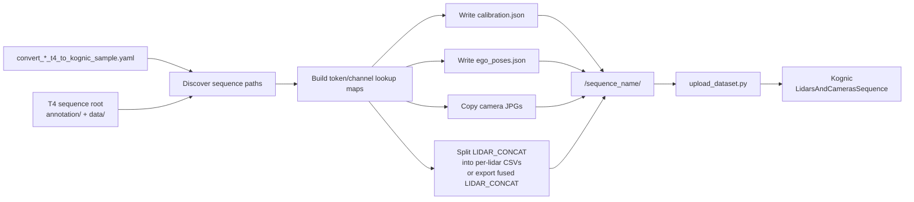
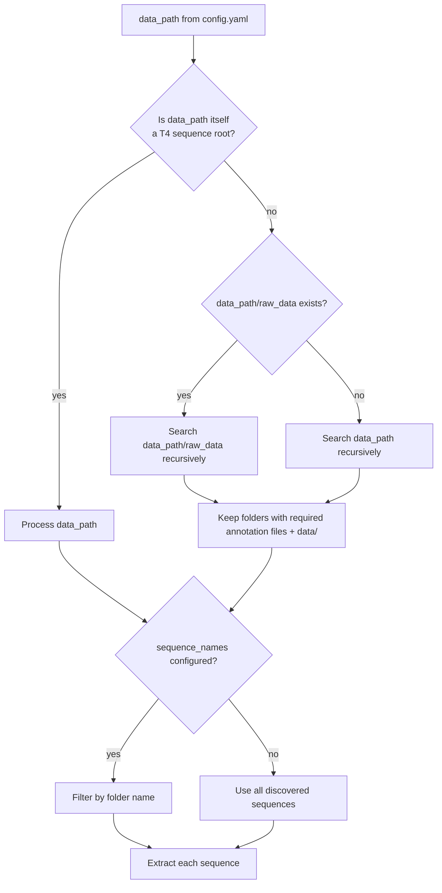
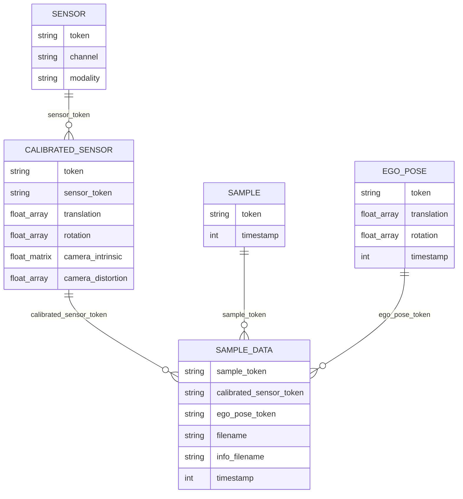
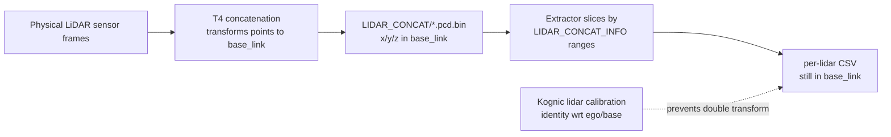
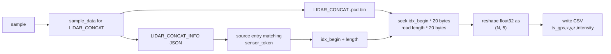
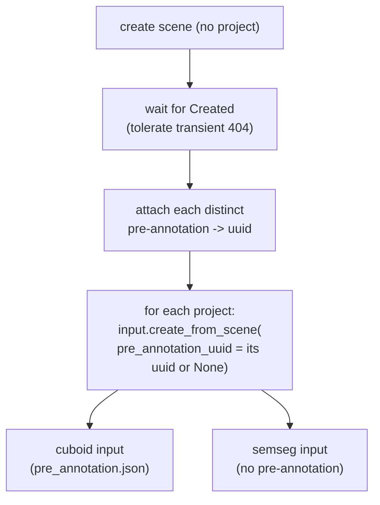
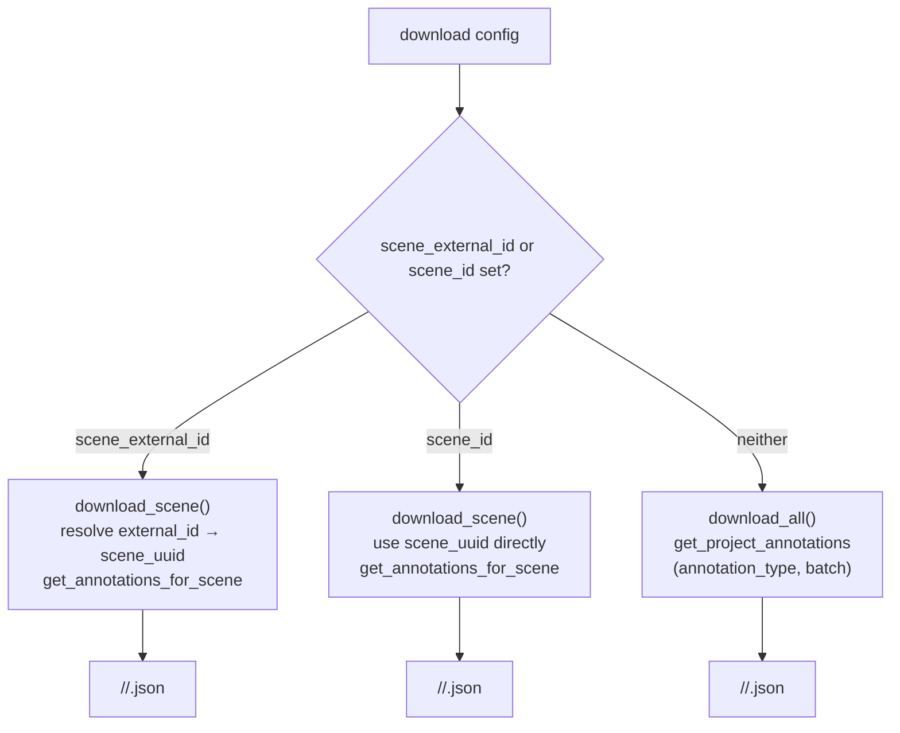

# Tier IV T4 ⇄ Kognic Pipeline

This document describes the full round-trip pipeline that takes a Tier IV **T4** dataset to the **Kognic** annotation platform and brings the finished annotations back into T4 format. It covers every stage end to end:

1. **Convert non-annotated T4 → Kognic staging format** — reshape T4 sensor data (cameras, LiDAR, calibration, ego poses) into the local layout the Kognic uploader consumes.
2. **Convert annotated T4 → Kognic staging format + pre-annotation** — the same sensor-data conversion, plus an OpenLABEL `pre_annotation.json` so existing 3D boxes are pre-loaded for labelers.
3. **Upload the staging format to Kognic** — create the calibration, build a `LidarsAndCamerasSequence`, upload each sequence **once** as a single scene, and create one input per configured project (each input optionally referencing a pre-annotation).
4. **Download annotations from Kognic** — pull completed OpenLABEL annotations to local disk, either for the whole project or for a single scene.
5. **Convert Kognic annotations → T4 annotation tables** — merge the downloaded OpenLABEL back into a non-annotated T4 dataset (3D cuboids or point-cloud segmentation), enriching it in place.

Stages 1–3 are the "outbound" path (T4 → Kognic); stages 4–5 are the "inbound" path (Kognic → T4). Stage 2 (pre-annotation) and stage 5 (annotation import) are inverses of each other.

References:

- T4 format: [docs/t4_format_3d_detailed.md](t4_format_3d_detailed.md)
- Kognic supported file formats: <https://docs.kognic.com/api-guide/supported-file-formats>
- Kognic calibration overview: <https://docs.kognic.com/api-guide/calibrations-overview>
- Kognic pre-annotations: <https://docs.kognic.com/api-guide/pre-annotations>

## Pipeline at a Glance

| Stage                                      | Command                                                                                                     | Input                             | Output                              | Code                                                                                      |
| ------------------------------------------ | ----------------------------------------------------------------------------------------------------------- | --------------------------------- | ----------------------------------- | ----------------------------------------------------------------------------------------- |
| 1. Non-annotated T4 → Kognic staging       | `python -m perception_dataset.convert --config config/convert_non_annotated_t4_to_kognic_sample.yaml`       | T4 dataset                        | Kognic staging dir                  | [t4_to_kognic_converter.py](../perception_dataset/kognic/t4_to_kognic_converter.py)       |
| 2. Annotated T4 → staging + pre-annotation | `python -m perception_dataset.convert --config config/convert_annotated_t4_to_kognic_sample.yaml`           | Annotated T4 dataset              | Staging dir + `pre_annotation.json` | + [t4_to_openlabel.py](../perception_dataset/kognic/t4_to_openlabel.py)                   |
| 3. Upload staging → Kognic                 | `python -m perception_dataset.kognic.upload_dataset --config config/upload_kognic_dataset_sample.yaml`      | Kognic staging dir                | Kognic scene (remote)               | [upload_dataset.py](../perception_dataset/kognic/upload_dataset.py)                       |
| 4. Download annotations                    | `python -m perception_dataset.kognic.download_annotation --config config/download_kognic_annotation_*.yaml` | Kognic project/scene (remote)     | OpenLABEL JSON files                | [download_annotation.py](../perception_dataset/kognic/download_annotation.py)             |
| 5. Kognic annotations → T4 tables          | `python -m perception_dataset.convert --config config/convert_kognic_annotation_to_t4_sample.yaml`          | Non-annotated T4 + OpenLABEL JSON | Annotated T4 dataset                | [openlabel_to_t4_converter.py](../perception_dataset/kognic/openlabel_to_t4_converter.py) |

Stages 1, 2, and 5 are dispatched through `perception_dataset/convert.py` by their `task:` key. Stages 3 and 4 are standalone modules that talk to the Kognic API and read credentials from the environment (see [Authentication](#authentication)).

```mermaid
flowchart LR
  subgraph Outbound["Outbound: T4 → Kognic"]
    T4["T4 dataset<br/>annotation/ + data/"]
    Stage1["Stage 1/2<br/>t4_to_kognic_converter<br/>(+ t4_to_openlabel)"]
    Staging["Kognic staging dir<br/>calibration.json, ego_poses.json,<br/>cameras/, lidar/<br/>(+ pre_annotation.json)"]
    Stage3["Stage 3<br/>upload_dataset"]
    Kognic["Kognic platform<br/>LidarsAndCamerasSequence"]
    T4 --> Stage1 --> Staging --> Stage3 --> Kognic
  end
  subgraph Inbound["Inbound: Kognic → T4"]
    Kognic2["Kognic platform<br/>completed annotations"]
    Stage4["Stage 4<br/>download_annotation"]
    OL["OpenLABEL JSON<br/>per scene"]
    Stage5["Stage 5<br/>openlabel_to_t4_converter"]
    T4out["T4 dataset<br/>annotation tables populated"]
    Kognic2 --> Stage4 --> OL --> Stage5 --> T4out
  end
  Kognic -. "annotate on platform" .-> Kognic2
```



---

## Stage 1 — T4 Sensor Data → Kognic Staging Format

[t4_to_kognic_converter.py](../perception_dataset/kognic/t4_to_kognic_converter.py) reads a Tier IV T4 sequence and reshapes it into the staging layout consumed by [upload_dataset.py](../perception_dataset/kognic/upload_dataset.py). Both `convert_non_annotated_t4_to_kognic` and `convert_annotated_t4_to_kognic` run this stage; the annotated task adds [Stage 2](#stage-2--t4-annotations--openlabel-pre-annotation) on top.

### Scope

The extractor creates a Kognic-ready local staging format for the Kognic IO uploader:

```text
<output_base>/<sequence_name>/
  calibration.json
  ego_poses.json
  cameras/<camera_name>/<timestamp_ns>.jpg
  lidar/<lidar_name>/<timestamp_ns>.csv
```

An uploader then reads this folder, creates a Kognic sensor calibration, builds a `LidarsAndCamerasSequence`, attaches per-frame images and point clouds, and uploads the scene.

The converter always extracts all available sensor frames from `sample_data.json` (falling back to `sample.json` if no anchor channel is found). There is no sample-level (key-frame-only) export mode; annotation frequency is decided at upload time via `target_hz` (see [Annotation Interval Selection](#annotation-interval-selection)).

### High-Level Flow



### Input T4 Data Used

The extractor expects each sequence root to contain both `annotation/` and `data/`. A folder is treated as a sequence when these annotation files exist:

| T4 file                         | How the extractor uses it                                                                                                                   |
| ------------------------------- | ------------------------------------------------------------------------------------------------------------------------------------------- |
| `sensor.json`                   | Maps `sensor_token` to sensor channel name, such as `CAM_FRONT` or `LIDAR_FRONT_UPPER`.                                                     |
| `calibrated_sensor.json`        | Reads sensor extrinsics, camera intrinsics, and camera distortion values.                                                                   |
| `sample.json`                   | Defines the ordered frame list. The extractor sorts samples by `timestamp`.                                                                 |
| `sample_data.json`              | Finds each sample's file path, calibrated sensor token, ego pose token, timestamp, and LiDAR info file.                                     |
| `ego_pose.json`                 | Reads ego vehicle pose in the map/odometry frame.                                                                                           |
| `data/<camera>/...`             | Source camera images.                                                                                                                       |
| `data/LIDAR_CONCAT/*.pcd.bin`   | Concatenated point cloud arrays. T4 stores points as float32 `(N, 5)`: `x, y, z, intensity, ring_idx`, with `x/y/z` already in `base_link`. |
| `data/LIDAR_CONCAT_INFO/*.json` | Gives per-source LiDAR point ranges inside each concatenated cloud.                                                                         |

Camera sensors are configured in `conversion.camera_sensors`.

### Sequence Discovery



If no sequence roots are found, extraction fails early with a `FileNotFoundError`.

### Lookup Maps

Before extracting files, `_build_lookup_maps()` loads the annotation tables and builds fast joins:



Important in-memory maps:

| Map                                 | Purpose                                               |
| ----------------------------------- | ----------------------------------------------------- |
| `token_to_channel`                  | `sensor_token -> channel`                             |
| `channel_to_token`                  | `channel -> sensor_token`                             |
| `calib_by_token`                    | `calibrated_sensor_token -> calibrated_sensor record` |
| `calib_by_sensor_token`             | `sensor_token -> calibrated_sensor record`            |
| `sample_data_by_sample`             | `sample_token -> all sample_data records`             |
| `sample_data_by_sample_and_channel` | `sample_token -> channel -> sample_data record`       |
| `ego_pose_by_token`                 | `ego_pose_token -> ego_pose record`                   |

### Calibration Conversion

`_extract_calibration()` produces `calibration.json` using Kognic IO model classes. Think of this file as the calibration for the extracted Kognic input files, not as a direct export of T4 `calibrated_sensor.json`. For cameras those are effectively the same calibration values, because the image pixels are still in the camera frame. For LiDARs they differ, because the extractor writes point coordinates that already live in `base_link`.

#### Cameras

Each configured camera becomes a `PinholeCalibration`:

| Kognic field                             | T4 source                                                                   |
| ---------------------------------------- | --------------------------------------------------------------------------- |
| `position.x/y/z`                         | `calibrated_sensor.translation`                                             |
| `rotation_quaternion.w/x/y/z`            | `calibrated_sensor.rotation` in T4 scalar-first order `[w, x, y, z]`        |
| `camera_matrix.fx`                       | `camera_intrinsic[0][0]`                                                    |
| `camera_matrix.fy`                       | `camera_intrinsic[1][1]`                                                    |
| `camera_matrix.cx`                       | `camera_intrinsic[0][2]`                                                    |
| `camera_matrix.cy`                       | `camera_intrinsic[1][2]`                                                    |
| `distortion_coefficients.k1/k2/p1/p2/k3` | First five values from `camera_distortion`; missing values default to `0.0` |
| `image_width`, `image_height`            | Read from the first JPG in `data/<camera_name>/`                            |

#### LiDARs

Each configured LiDAR becomes a `LidarCalibration` with **identity** pose:

```json
{ "position": { "x": 0, "y": 0, "z": 0 }, "rotation_quaternion": { "w": 1, "x": 0, "y": 0, "z": 0 } }
```

This is intentional. In the T4 point-cloud format, `LIDAR_CONCAT/*.pcd.bin` points are already transformed into `base_link`. The extractor uses `LIDAR_CONCAT_INFO` only to slice the already-fused cloud back into source LiDAR subsets. Applying each physical LiDAR mount calibration again would double-transform the points.



### Ego Pose Conversion

`_extract_ego_poses()` writes `ego_poses.json`, keyed by frame index as strings (`"0"`, `"1"`, ...). The source T4 ego poses describe the ego vehicle in a map/odometry frame; the extractor converts them into poses relative to frame 0:

```text
T_rel(frame_i) = inverse(T_ego_frame_0_to_world) * T_ego_frame_i_to_world
```

Frame 0 therefore becomes position `(0, 0, 0)` with identity rotation. Later frames describe ego motion relative to that first frame. The uploader passes these poses into each `LidarsAndCamerasSequenceFrame` as `ego_vehicle_pose`, and can upsample them to IMU-like 200 Hz samples when configured.

> The converter does not resample the raw T4 ego-pose stream. It loads `sample.json`, finds each sample's `LIDAR_CONCAT` `sample_data` record, reads that record's `ego_pose_token`, and converts only those selected poses. In the sample dataset the raw T4 ego poses are ~10 Hz while `sample.json` frames are ~1 Hz, so the intermediate poses exist but are not written. To exclude them from annotation, set `target_hz` at upload time.

### Image Extraction

`_extract_images()` copies configured camera images into `cameras/<sensor_name>/`.

| Output detail               | Rule                                                                                   |
| --------------------------- | -------------------------------------------------------------------------------------- |
| Source                      | `sample_data.filename`, such as `data/CAM_FRONT/00000.jpg`                             |
| Output filename             | `<timestamp_ns>.jpg`                                                                   |
| Timestamp conversion        | T4 `sample_data.timestamp` is microseconds, so the extractor writes `timestamp * 1000` |
| Missing camera for a sample | The frame is skipped for that camera only                                              |
| Existing destination file   | Not overwritten                                                                        |

### LiDAR Extraction

`_extract_pointclouds()` normally turns one T4 concatenated point-cloud file into one CSV per source LiDAR using `LIDAR_CONCAT_INFO`. It also supports a **concat-only fallback**: if the sequence has `data/LIDAR_CONCAT/*.pcd.bin` but no `data/LIDAR_CONCAT_INFO/`, it exports the whole fused cloud as `lidar/LIDAR_CONCAT/<timestamp_ns>.csv` with an identity `LIDAR_CONCAT` calibration (source-LiDAR partitions cannot be recovered in that mode).



Each T4 point has five `float32` values (`x, y, z, intensity, ring_idx`); the extractor preserves only `ts_gps,x,y,z,intensity`. Kognic's CSV format requires exact column names, comma separation, and a timestamp column (the full documented header is `ts_gps,x,y,z,intensity,rgb,red,green,blue`; the RGB columns are optional and not written here). No point filtering, deduplication, or coordinate transformation is performed; the only change is formatting numeric fields to six decimal places.

### Stage 1 Config Parameters

The converter is driven by a `conversion` block. These keys are read by direct indexing in `convert.py`, so all are required even though the converter class itself has fallbacks.

```yaml
task: convert_non_annotated_t4_to_kognic # or: convert_annotated_t4_to_kognic
conversion:
  input_base: ./data/non_annotated_t4_format
  output_base: ./data/kognic_format
  workers_number: 12
  drop_camera_token_not_found: false
  camera_sensors:
    - channel: CAM_FRONT
    - channel: CAM_FRONT_RIGHT
    - channel: CAM_BACK_RIGHT
    - channel: CAM_BACK
    - channel: CAM_BACK_LEFT
    - channel: CAM_FRONT_LEFT
```

| Parameter                     | Required | Default | Description                                                                                                                                                                                                                                            |
| ----------------------------- | -------- | ------- | ------------------------------------------------------------------------------------------------------------------------------------------------------------------------------------------------------------------------------------------------------ |
| `input_base`                  | Yes      | —       | Path to the T4 dataset. May be a single sequence root (a folder with `annotation/` + `data/` and the required tables) or a parent directory whose children are searched recursively for sequence roots. See [Sequence Discovery](#sequence-discovery). |
| `output_base`                 | Yes      | —       | Directory where each scene's staging folder `<output_base>/<scene>/` is written.                                                                                                                                                                       |
| `camera_sensors`              | Yes      | —       | List of `{channel: <name>}` entries naming the T4 camera channels to copy. Channels absent from the dataset, or present but with no image files, are skipped with a warning, allowing LiDAR-only conversion.                                           |
| `workers_number`              | Yes      | `32`    | Size of the thread pool used to copy camera images in parallel.                                                                                                                                                                                        |
| `drop_camera_token_not_found` | Yes      | `false` | When a selected frame has no `sample_data` for a camera: `false` keeps the frame (that camera is simply absent for it); `true` logs and skips that camera for the frame. The frame's LiDAR and other cameras are exported either way.                  |

For non-annotated T4 data, annotation tables (if present) are ignored.

### Testing

Stage 1 is covered by a conversion-and-comparison test that mirrors the Deepen test setup (`tests/test_tlr_dataset_conversion.py`): run the converter on a committed T4 input fixture and diff the result byte-for-byte against a committed golden output.

| Piece         | Path                                                                                                                      |
| ------------- | ------------------------------------------------------------------------------------------------------------------------- |
| Test          | [tests/kognic/test_kognic_dataset_conversion.py](../tests/kognic/test_kognic_dataset_conversion.py)                       |
| Test config   | [tests/config/convert_non_annotated_t4_to_kognic_test.yaml](../tests/config/convert_non_annotated_t4_to_kognic_test.yaml) |
| Input fixture | `tests/data/t4_sample_0/non_annotated_dataset/` (LiDAR + 6 cameras)                                                       |
| Golden output | `tests/data/t4_sample_0/kognic_format_from_non_annotated_t4/`                                                             |

The test fixture runs `T4ToKognicConverter` into a sibling output dir suffixed `_generated`, then `tests.utils.check_equality.diff_check_folder` compares it against the same path with `_generated` stripped — the committed golden fixture. The `_generated` dir is removed on teardown, so only the golden copy is checked in. Because the comparison is byte-for-byte, the converter output must stay deterministic (stable JSON key order, frame ordering, and CSV formatting).

```bash
uv run pytest tests/kognic/test_kognic_dataset_conversion.py -v
```

To regenerate the golden fixture after an intentional converter change, run the converter on the input fixture, eyeball the output, then copy it to the non-`_generated` name (e.g. `kognic_format_from_non_annotated_t4/`) and commit it.

---

## Stage 2 — T4 Annotations → OpenLABEL Pre-Annotation

When the task is `convert_annotated_t4_to_kognic`, [t4_to_openlabel.py](../perception_dataset/kognic/t4_to_openlabel.py) (`T4ToOpenLabelConverter`) runs after Stage 1 and writes a `pre_annotation.json` into each scene's staging directory:

```text
<output_base>/<scene>/
  calibration.json
  ego_poses.json
  pre_annotation.json     <- added by Stage 2
  cameras/...  lidar/...
```

It reads `sample_annotation.json` (and companion tables) and exports every 3D box as a Kognic OpenLABEL cuboid, following the [Kognic pre-annotation format](https://docs.kognic.com/api-guide/pre-annotations). The uploader (Stage 3) attaches a pre-annotation file to a project's input only when that project's config entry names it via `pre_annotation:` (see [Projects, Batches, and Pre-Annotations](#projects-batches-and-pre-annotations)); so labelers for that project see the boxes pre-loaded, while other projects on the same scene can be created without it.

### Coordinate Convention

Cuboids are expressed in the **per-frame ego/`base_link`** coordinate system (required for multi-LiDAR scenes), composing with the T0-normalised ego poses uploaded in Stage 3. The cuboid `val` is `[x, y, z, qx, qy, qz, qw, sx, sy, sz]` with yaw 0 facing **+y**, so T4 box rotations are post-multiplied by `Rz(-90°)` and T4 sizes (width, length, height) map unchanged. This is exactly the transform that [Stage 5](#stage-5--kognic-annotations--t4-annotation-tables) inverts.

### Frame Matching

Pre-annotation frames are matched to the staged scene frames so the cuboids land on the right capture time:

- The staging frames were generated one per `LIDAR_CONCAT` record in timestamp order, so when the staged frame count **equals** the `LIDAR_CONCAT` record count the mapping is positional.
- When the counts differ, the converter falls back to nearest-timestamp matching within `frame_match_tolerance_ms`. Records with no staged frame inside the tolerance are dropped and logged.

`frame_properties.timestamp` mirrors the uploader's `relative_timestamp` (milliseconds since the first anchor frame).

### Attributes vs. Geometry

The cuboid geometry only carries the `stream` marker tying it to the LiDAR sensor frame. Class properties (e.g. `vehicle_state.driving`) must live on the **object** (`object_data.text`), not on the geometry — Kognic rejects source-specific properties on 3D geometry. The `stream` marker is always written; class properties are written only when `include_attributes: true`, and the property names must be defined for that class in the Kognic task definition or the upload is rejected.

### Stage 2 Config Parameters

These keys live in the same `conversion` block as Stage 1 and are read with defaults, so all are optional:

```yaml
task: convert_annotated_t4_to_kognic
conversion:
  # ... Stage 1 keys (input_base, output_base, camera_sensors, ...) ...
  lidar_stream: ""
  category_map: {}
  include_attributes: true
  frame_match_tolerance_ms: 50
```

| Parameter                  | Required | Default                            | Description                                                                                                                                                                                                                 |
| -------------------------- | -------- | ---------------------------------- | --------------------------------------------------------------------------------------------------------------------------------------------------------------------------------------------------------------------------- |
| `lidar_stream`             | No       | `""`                               | Kognic stream the cuboids are tied to via the geometry's `stream` marker. Empty means use the anchor LiDAR stream (the first staged LiDAR in `PREFERRED_LIDAR_SENSORS` order), matching how the uploader anchors frames.    |
| `category_map`             | No       | `{}`                               | Mapping from T4 category names to Kognic task-definition class names, e.g. `{car: PassengerCar}`. Categories not in the map pass through unchanged. The resulting class name must exist in the Kognic task definition.      |
| `include_attributes`       | No       | `false` (code); sample uses `true` | When `true`, each annotation's T4 attributes are exported as object-level text properties. The names must be defined for that class in the Kognic task definition.                                                          |
| `frame_match_tolerance_ms` | No       | `50.0`                             | Tolerance used **only** when the staged frame count differs from the `LIDAR_CONCAT` record count, forcing nearest-timestamp matching. Records with no frame within the tolerance are dropped. Unused when the counts match. |

---

## Stage 3 — Upload Staging Format to Kognic

[upload_dataset.py](../perception_dataset/kognic/upload_dataset.py) uploads the staging folders produced by Stages 1–2. It follows the same script shape as [perception_dataset/deepen/upload_dataset.py](../perception_dataset/deepen/upload_dataset.py):

```bash
export KOGNIC_CREDENTIALS=/path/to/kognic_credentials.json
python -m perception_dataset.kognic.upload_dataset --config config/upload_kognic_dataset_sample.yaml
```

All staged frames are uploaded. Annotation frequency is controlled at upload time via `target_hz`: frames at that interval are marked `annotate=True`, and the rest are uploaded as context with `annotate=False`. When `target_hz` is omitted, every frame is marked `annotate=True`.

Each sequence is uploaded **once** as a single scene. The uploader then creates **one input per configured project** from that scene, so the same sensor data can feed several projects/batches without re-uploading it. See [Projects, Batches, and Pre-Annotations](#projects-batches-and-pre-annotations).

### Projects, Batches, and Pre-Annotations

Projects are configured under a `projects:` list — each entry is one input created from the shared scene:

```yaml
projects:
  - external_id: my_cuboid_project
    batch: my_cuboid_batch # optional; omit -> latest open batch
    pre_annotation: pre_annotation.json # optional; filename relative to the sequence dir
  - external_id: my_semseg_project
    batch: my_semseg_batch # no pre_annotation -> input created without one
```

- **`external_id`** (required) — the Kognic project to create the input in.
- **`batch`** (optional) — the batch within that project; defaults to the project's latest open batch.
- **`pre_annotation`** (optional) — filename (relative to each sequence's staging dir) of the OpenLABEL pre-annotation to apply to **this** input. Omit it for no pre-annotation on that input. Defaults to none.

A `(external_id, batch)` pair must be unique across the list; a duplicate raises a `ValueError` before any upload.

**One scene, per-input pre-annotations.** The scene is created once, every distinct pre-annotation file referenced by the projects is attached to it, and each input is then created with `client.input.create_from_scene(scene_uuid, pre_annotation_uuid=…)` — passing that project's pre-annotation UUID, or `None` for no pre-annotation. Because the pre-annotation is selected **per input** (not applied scene-wide), projects with incompatible task definitions can share one scene: e.g. a **3D-cuboid** project whose input references a cuboid `pre_annotation.json`, alongside a **semantic-segmentation** project whose input is created with no pre-annotation. A cuboid pre-annotation would be rejected by a semseg task definition, so it is simply not attached to that input.

**Upload flow per sequence (scene-first):**

1. Create the scene with no project, then poll until it reaches `Created` (a transient `404` from the scene-status query right after creation is tolerated and retried — the scene exists, it is just not queryable yet).
2. Attach each distinct pre-annotation file to the scene, capturing its UUID.
3. Create one input per project via `client.input.create_from_scene`, each referencing its project's pre-annotation UUID (or `None`).



### Authentication

The uploader (and the downloader in [Stage 4](#stage-4--download-annotations-from-kognic)) read Kognic API credentials from the environment. Set one of:

| Method           | Environment variable                        | Value                                                                            |
| ---------------- | ------------------------------------------- | -------------------------------------------------------------------------------- |
| Credentials file | `KOGNIC_CREDENTIALS`                        | Path to a JSON file with `clientId`, `clientSecret`, `email`, `userId`, `issuer` |
| Separate vars    | `KOGNIC_CLIENT_ID` + `KOGNIC_CLIENT_SECRET` | Client ID and secret directly                                                    |

The credentials JSON file is downloaded from the Kognic platform under your account's [API credentials](https://developers.kognic.com/docs/getting-started/quickstart/#generating-credentials) section.

### Stage 3 Config Parameters

```yaml
task: upload_kognic_dataset
conversion:
  input_base: ./data/kognic_format
  organization_id: "114"
  workspace_id: efa90d1e-99bc-4064-98bb-5bfc8758157d
  projects:
    - external_id: my_cuboid_project
      batch: my_cuboid_batch # optional; omit -> latest open batch
      pre_annotation: pre_annotation.json # optional; omit -> no pre-annotation
    - external_id: my_semseg_project # second input from the same scene
  target_hz: 1 # optional
  # annotation_interval_tolerance_s: 0.05  # optional; leniency (+/-) when matching target_hz
  dryrun: false
  motion_compensate: false
  include_imu_data: true
  write_debug_frames: false
  # scene_creation_timeout_s: 1800          # optional; max wait for a scene to reach Created
  # scene_creation_poll_interval_s: 10      # optional; poll cadence while waiting
```

| Parameter                         | Required | Default | Description                                                                                                                                                                                                                                                                                                                                 |
| --------------------------------- | -------- | ------- | ------------------------------------------------------------------------------------------------------------------------------------------------------------------------------------------------------------------------------------------------------------------------------------------------------------------------------------------- |
| `input_base`                      | Yes      | —       | Path to the staged Kognic format data. Can be a single sequence directory (containing `calibration.json`) or a parent directory of multiple sequence subdirectories.                                                                                                                                                                        |
| `organization_id`                 | Yes      | —       | Your Kognic organization ID (also accepted as `client_organization_id`).                                                                                                                                                                                                                                                                    |
| `workspace_id`                    | Yes      | —       | The Kognic workspace UUID to write scenes into (also accepted as `write_workspace_id`).                                                                                                                                                                                                                                                     |
| `projects`                        | No       | `[]`    | List of projects to create inputs in from the shared scene. Each entry has `external_id` (required) plus optional `batch` and `pre_annotation`. See [Projects, Batches, and Pre-Annotations](#projects-batches-and-pre-annotations). If omitted/empty, the scene is created with no input. Each `(external_id, batch)` pair must be unique. |
| `target_hz`                       | No       | `None`  | Controls which frames are marked `annotate=True`. All staged frames are uploaded regardless, but only frames at least `1 / target_hz` seconds apart are flagged for annotation. Omit to annotate every frame. See [Annotation Interval Selection](#annotation-interval-selection).                                                          |
| `annotation_interval_tolerance_s` | No       | `None`  | Leniency in seconds (`+/-`) applied when checking the `target_hz` interval, so a frame near a nominal boundary isn't skipped. Defaults to half the median source frame interval; set `0` to disable. Ignored when `target_hz` is unset.                                                                                                     |
| `dryrun`                          | No       | `false` | When `true`, validates the scene structure against the Kognic API but does not create a scene, upload sensor files, attach pre-annotations, or create inputs. The calibration **is** uploaded for real even in dryrun mode. The scene id is recorded as `"dryrun"` in `dataset_id.json`.                                                    |
| `motion_compensate`               | No       | `false` | When `false`, sends `FeatureFlags()` disabling server-side motion compensation. When `true`, no feature flags are sent and Kognic applies its default motion compensation. Requires accurate IMU or ego-pose data.                                                                                                                          |
| `include_imu_data`                | No       | `true`  | When `true`, generates a 200 Hz IMU-like stream by interpolating `ego_poses.json` and attaches it. Requires at least two ego-pose entries; otherwise no IMU data is attached.                                                                                                                                                               |
| `write_debug_frames`              | No       | `false` | When `true`, writes a `frames_debug.json` next to each staged sequence after building the frame list — the full Kognic model dump, useful for inspecting what was sent without checking the platform UI.                                                                                                                                    |
| `scene_creation_timeout_s`        | No       | `1800`  | Maximum time to wait for a created scene to reach `Created` before raising `TimeoutError`.                                                                                                                                                                                                                                                  |
| `scene_creation_poll_interval_s`  | No       | `10`    | How often to poll the scene status while waiting for `Created`.                                                                                                                                                                                                                                                                             |

### Frame Pairing and Calibration

The uploader anchors frames on the first available LiDAR stream, preferring the normal Tier IV LiDAR order (`LIDAR_FRONT_UPPER`, `LIDAR_FRONT_LOWER`, ...) and falling back to `LIDAR_CONCAT` when the converter exported a fused concat-only cloud. Other LiDAR and camera streams are attached by frame order, not by requiring identical filenames; each camera keeps its own shutter timestamp from its image filename.

| Kognic frame field   | Source                                                                                           |
| -------------------- | ------------------------------------------------------------------------------------------------ |
| `frame_id`           | Sequential extracted frame index as a string.                                                    |
| `unix_timestamp`     | Anchor LiDAR timestamp in nanoseconds.                                                           |
| `relative_timestamp` | Milliseconds since the first anchor frame.                                                       |
| `ego_vehicle_pose`   | Matching entry from `ego_poses.json`.                                                            |
| `point_clouds`       | CSV files under `lidar/<sensor>/`.                                                               |
| `images`             | JPG files under `cameras/<sensor>/`, with shutter start/end set to the image filename timestamp. |

**Calibration deduplication:** within a single run, if multiple sequences share a byte-for-byte identical `calibration.json`, only the first calibration upload is sent; later sequences reuse the returned `calibration_id`.

### Annotation Interval Selection

When `target_hz` is set, the uploader walks frames in timestamp order and flags a frame whenever enough time has elapsed since the last flagged frame:

```text
annotate frame if (timestamp_ns - last_annotated_ts) >= (min_interval_ns - tolerance_ns)
min_interval_ns = 1e9 / target_hz
```

The tolerance exists because **T4 frames are rarely spaced at exactly `1 / source_hz`** — each step is slightly short of the nominal interval (e.g. `0.09997s` instead of `0.1s`). That deficit accumulates, so a frame at a nominal boundary lands just below the target:

| Frame  | Nominal time | Actual elapsed since reference | Strict `>= 1.0s`?              |
| ------ | ------------ | ------------------------------ | ------------------------------ |
| idx 9  | 0.9s         | 0.899995s                      | skip (correct)                 |
| idx 10 | 1.0s         | 0.999994s                      | **skipped** — only ~6 µs short |
| idx 11 | 1.1s         | 1.099991s                      | annotated                      |

With a strict check the `1.0s` frame is dropped and the cadence drifts to `0.0, 1.1, 2.1, 3.2, ...`. The tolerance is applied **only to the comparison**; the frame's original timestamp is still stored as `last_annotated_ts`, so leniency never accumulates. When omitted, it defaults to **half the median source frame interval**. With the default, `target_hz: 1` correctly selects `0.0, 1.0, 2.0, 3.0, ...`.

### Stage 3 Output

After each sequence is uploaded, the script writes `dataset_id.json` under `input_base`, keyed by staged folder name. Each entry records the scene UUID and one record per created input (`project_name`, `batch_name`, `input_id`):

```json
{
  "sequence-name-a": {
    "scene_id": "9f8d5889-6a89-4881-bb67-657cf1a0f95a",
    "inputs": [
      { "project_name": "my_cuboid_project", "batch_name": "my_cuboid_batch", "input_id": "bbb" },
      { "project_name": "my_semseg_project", "batch_name": "my_semseg_batch", "input_id": "ccc" }
    ]
  },
  "sequence-name-b": { "scene_id": "dryrun", "inputs": [] }
}
```

`batch_name` is the configured batch (may be `null` when omitted, meaning the latest open batch was used). A project/batch with several annotation types yields one input record per type. Downstream cleanup tools (`delete_scenes.py`, `invalidate_unused_scenes.py`) read `scene_id` from this structure (and still accept the legacy flat `{name: scene_uuid}` form).

#### Failure reporting

Once a scene exists server-side it must end up with at least one input, or it is an orphan (no input, invisible to labelers). The uploader handles failures per sequence:

- **Scene processing / pre-annotation fails** (before any input) → the orphan scene is invalidated and the failure recorded.
- **All inputs fail** → the orphan scene is invalidated.
- **Some inputs succeed, some fail** → the scene is **kept** (it is not an orphan); succeeded inputs are recorded in `dataset_id.json` and the failed `project/batch`es are reported so you can re-run to create just the missing inputs.
- **Invalidation itself fails** (e.g. the scene is not yet queryable) → the scene is left on Kognic and reported as an orphan needing **manual** cleanup, rather than being silently reported as invalidated.

At the end of the run the script exits non-zero with a summary listing scenes created without an input, orphans that could not be invalidated (as `external_id=scene_uuid`), and scenes kept with only partial inputs.

---

## Stage 4 — Download Annotations from Kognic

[download_annotation.py](../perception_dataset/kognic/download_annotation.py) (`KognicAnnotationDownloader`) downloads completed annotations (OpenLABEL JSON) from the Kognic platform to local disk. Like the uploader, it reads credentials from the environment (see [Authentication](#authentication)).

```bash
export KOGNIC_CREDENTIALS=/path/to/kognic_credentials.json
python -m perception_dataset.kognic.download_annotation --config config/download_kognic_annotation_per_dataset_sample.yaml
```

Output goes to `output_base/<project_external_id>/`. The download mode is **auto-detected** from the config:

- **Project-wide** (default) — set `annotation_type` (and optionally `batch`) to download every matching annotation in the project. One `<scene_uuid>.json` is written per scene. Config: `config/download_kognic_annotation_whole_project.yaml`.
- **Single scene** — set either `scene_external_id` or `scene_id` (the scene UUID) to download all annotations for one scene. With `scene_external_id` the external id is resolved to its scene UUID via the project's inputs; with `scene_id` the UUID is used directly (no lookup). Set only one of the two; either way `annotation_type`/`batch` are ignored. Files are written as `<scene_external_id>.json` / `<scene_id>.json` (suffixed with the request id when a scene has multiple annotations). Config: `config/download_kognic_annotation_per_dataset_sample.yaml`.



### Stage 4 Config Parameters

```yaml
task: download_kognic_annotation
conversion:
  output_base: ./data/kognic_annotations
  organization_id: 114
  workspace_id: efa90d1e-99bc-4064-98bb-5bfc8758157d
  project_external_id: test_upload_data
  # Project-wide download:
  annotation_type: lidar-cuboid
  # batch: <batch_external_id>      # optional; omit for all batches
  # Single-scene download (mutually exclusive with annotation_type above):
  # set ONE of the two below
  # scene_external_id: <external_id>  # resolved to a scene_uuid via the API
  # scene_id: <scene_uuid>            # the scene UUID directly (skips lookup)
  iso_rotated_cuboids: false
```

| key                   | required                                          | description                                                                                                                                                                   |
| --------------------- | ------------------------------------------------- | ----------------------------------------------------------------------------------------------------------------------------------------------------------------------------- |
| `output_base`         | yes                                               | Directory where annotation JSONs are written.                                                                                                                                 |
| `organization_id`     | yes                                               | Kognic client organization id (alias: `client_organization_id`).                                                                                                              |
| `workspace_id`        | yes                                               | Kognic workspace id (alias: `write_workspace_id`).                                                                                                                            |
| `project_external_id` | yes                                               | Project to download from.                                                                                                                                                     |
| `annotation_type`     | yes, unless `scene_external_id`/`scene_id` is set | Annotation type to download (e.g. `lidar-cuboid`, `camera-tag`).                                                                                                              |
| `batch`               | no                                                | Restrict project-wide download to one batch (omit for all batches).                                                                                                           |
| `scene_external_id`   | no                                                | Download a single scene by external id instead of the whole project.                                                                                                          |
| `scene_id`            | no                                                | Download a single scene by its scene UUID directly (skips the external-id lookup); mutually exclusive with `scene_external_id`.                                               |
| `iso_rotated_cuboids` | no                                                | `true` → cuboids in ISO8855 frame; `false` (default) → Kognic internal frame. **Must match the value used in [Stage 5](#stage-5--kognic-annotations--t4-annotation-tables).** |

---

## Stage 5 — Kognic Annotations → T4 Annotation Tables

[openlabel_to_t4_converter.py](../perception_dataset/kognic/openlabel_to_t4_converter.py) (`OpenLabelToT4Converter`) merges the downloaded OpenLABEL into an existing **non-annotated** T4 dataset, enriching it **in place** (the populated tables, and any lidarseg files, are written back into each scene's `annotation/`). The annotation type is auto-detected per scene.

```bash
python -m perception_dataset.convert --config config/convert_kognic_annotation_to_t4_sample.yaml
```

```text
<output_base>/<scene>/                (T4 dataset, enriched in place)
    annotation/  data/  [lidarseg/]
<annotation_base>/
    <scene>.json  or  <scene_uuid>.json   (downloaded OpenLABEL from Stage 4)
```

### Scene Matching and Frame Matching

OpenLABEL files are indexed by filename stem and by OpenLABEL metadata (`dataset_id`, `source_filename`, `scene_uuid`, `input_external_id`, and nested `scene_metadata`). Each T4 scene is matched to a file by its directory name or any ancestor directory name up to the dataset root (T4 datasets are commonly nested as `<root>/<scene_id>/<version>/`, so the identifier is often an ancestor).

OpenLABEL frames are matched to T4 samples by the **LiDAR stream's URI timestamp**: when a usable timestamp is present it is authoritative (matched to the nearest sample within a 1 ms tolerance), so a frame whose capture time has no corresponding sample is reported as unmatched rather than mis-paired. The frame `external_id` is used as a positional fallback only when no timestamp is available. This makes subsampled annotation requests (covering only some scene frames) safe. Set `output_base` equal to the dataset path to enrich it in place.

### 3D Cuboids (Object Detection)

This is the inverse of [Stage 2](#stage-2--t4-annotations--openlabel-pre-annotation): cuboids in the per-frame ego frame are transformed back to global-frame T4 boxes (undoing the `Rz(-90°)` yaw convention). `iso_rotated_cuboids` **must match** the value used at download time. It populates the otherwise-empty tables:

```text
instance.json  category.json  attribute.json  visibility.json  sample_annotation.json
```

- Class properties (e.g. `vehicle_state`, `occlusion_state`) are imported as T4 attributes when `include_attributes` is `true`; `occlusion_state` additionally drives the `visibility` level.
- Instances are reused across frames by object UUID, with `next`/`prev` links and per-instance `nbr_annotations`/`first`/`last` finalised after all frames are placed.
- `num_lidar_pts` is computed from the actual point clouds after saving (left at `0` if the LiDAR data is unavailable); `num_radar_pts` is `0` and box velocity/acceleration are left unset.

### Point-Cloud Segmentation (`3DPointCloudSegmentation` / `semseg`)

When the OpenLABEL carries per-point segmentation (object type `3DPointCloudSegmentation`, or metadata `annotation_type: semseg`), the converter writes T4 lidarseg instead of boxes:

- `lidarseg.json` — one record per matched frame, linking a LiDAR `sample_data` token to its label file.
- `lidarseg/<version>/<token>.bin` — a `uint8` array of per-point class indices, one label per point in the corresponding `LIDAR_CONCAT` `.pcd.bin`, in the same order. Stale `.bin` files are cleared on each run.
- `category.json` — the OpenLABEL ontology classes, each with its ontology id as the T4 `index` (the value stored in the `.bin`). Index `0` is reserved for `background` (unlabelled points).

Labels are decoded from Kognic's run-length encoding (`#<count>V<class_id>` repeated). Kognic encodes labels sequentially from point 0 and omits a trailing run of unlabelled points, so when the RLE is shorter than the cloud the missing trailing points are treated as `background` (class `0`) and appended — logged as a warning per frame. A frame is skipped only when it has **more** labels than points (a genuine annotation/point-cloud mismatch) or when its LiDAR point cloud cannot be read.

### Stage 5 Config Parameters

```yaml
task: convert_kognic_annotation_to_t4
conversion:
  output_base: ./data/non_annotated_t4_format
  annotation_base: ./data/kognic_annotations/test_upload_data
  iso_rotated_cuboids: false
  # category_map: {}
  include_attributes: true
```

| Parameter             | Required | Default | Description                                                                                                                               |
| --------------------- | -------- | ------- | ----------------------------------------------------------------------------------------------------------------------------------------- |
| `output_base`         | Yes      | —       | T4 dataset to annotate; its annotation tables are populated in place. May be a single scene dir or a parent dir of scene dirs.            |
| `annotation_base`     | Yes      | —       | Directory holding the downloaded OpenLABEL JSON(s) from Stage 4. Files are matched to scenes by filename stem and OpenLABEL metadata.     |
| `iso_rotated_cuboids` | No       | `false` | **Must match** the flag used at download time: `true` → ISO8855 frame; `false` → Kognic internal frame.                                   |
| `category_map`        | No       | `{}`    | Optional rename of Kognic object types to T4 category names, e.g. `{car: vehicle.car}`. Unmapped types pass through unchanged.            |
| `include_attributes`  | No       | `true`  | Import class properties (`vehicle_state`, `occlusion_state`, ...) as T4 attributes. `occlusion_state` also drives the `visibility` level. |

---

## Reference: Kognic Staging File Shapes

The local "Kognic format" produced by Stage 1 is a staging layout for Kognic IO, not an exported annotation format. Each file is either uploaded directly as scene data or converted into a Kognic model object by the uploader.

```text
<output_base>/<sequence_name>/
  calibration.json
  ego_poses.json
  pre_annotation.json        # added by Stage 2 (annotated task only)
  cameras/<camera_name>/<timestamp_ns>.jpg
  lidar/<lidar_name>/<timestamp_ns>.csv
  frames_debug.json          # generated by the uploader when write_debug_frames: true
```

| File or folder                        | Created by | What it contains                                                                                                                                                                               |
| ------------------------------------- | ---------- | ---------------------------------------------------------------------------------------------------------------------------------------------------------------------------------------------- |
| `calibration.json`                    | Stage 1    | One Kognic calibration entry per configured sensor. Camera entries copy the T4 extrinsics/intrinsics; LiDAR entries are identity because the CSV points are already in `base_link`.            |
| `ego_poses.json`                      | Stage 1    | Frame-indexed ego poses relative to frame 0. Keys are frame indices as strings; values contain position and rotation quaternion.                                                               |
| `cameras/<camera>/<timestamp_ns>.jpg` | Stage 1    | A copied camera image named by its nanosecond timestamp.                                                                                                                                       |
| `lidar/<lidar>/<timestamp_ns>.csv`    | Stage 1    | A point cloud CSV with columns `ts_gps,x,y,z,intensity`. Per-source slice with `LIDAR_CONCAT_INFO`; whole fused `LIDAR_CONCAT` cloud without it. Points remain in `base_link`.                 |
| `pre_annotation.json`                 | Stage 2    | OpenLABEL pre-annotation of the T4 3D boxes. Attached at upload time to a project's input only when that project names it via `pre_annotation:`; other projects on the same scene can skip it. |
| `frames_debug.json`                   | Stage 3    | A local forensic dump of the constructed scene (frame IDs, timestamps, metadata, images, point clouds). Not uploaded; useful in `dryrun` mode. Written only when `write_debug_frames: true`.   |

### File Examples

`calibration.json` is keyed by sensor name. A camera entry is a pinhole model; a LiDAR entry is intentionally identity (the extracted CSV points are already in `base_link`, so copying the physical LiDAR transform would double-transform the cloud):

```json
{
  "CAM_FRONT": {
    "calibration_type": "pinhole",
    "position": { "x": 5.38, "y": 0.04, "z": 2.76 },
    "rotation_quaternion": { "w": -0.49, "x": 0.5, "y": -0.5, "z": 0.49 },
    "image_height": 1860,
    "image_width": 2880,
    "camera_matrix": { "fx": 875.94, "fy": 1252.96, "cx": 1403.32, "cy": 946.4 },
    "field_of_view": null,
    "distortion_coefficients": { "k1": 0.0, "k2": 0.0, "p1": 0.0, "p2": 0.0, "k3": 0.0 }
  },
  "LIDAR_FRONT_UPPER": {
    "calibration_type": "lidar",
    "position": { "x": 0.0, "y": 0.0, "z": 0.0 },
    "rotation_quaternion": { "w": 1.0, "x": 0.0, "y": 0.0, "z": 0.0 }
  }
}
```

`ego_poses.json` is keyed by frame index. The uploader pairs these indices with frames discovered from the anchor LiDAR CSV files:

```json
{
  "0": { "position": { "x": 0.0, "y": 0.0, "z": 0.0 }, "rotation": { "w": 1.0, "x": 0.0, "y": 0.0, "z": 0.0 } },
  "1": {
    "position": { "x": 0.015, "y": 0.0002, "z": 0.0001 },
    "rotation": { "w": 0.999, "x": 1.5e-5, "y": 5.3e-5, "z": 1.1e-6 }
  }
}
```

LiDAR CSV files repeat the same timestamp on every row because the file represents one sweep:

```csv
ts_gps,x,y,z,intensity
1754014709448765440,-24.725380,29.134949,13.424894,22.000000
1754014709448765440,-23.788845,29.203459,13.249804,21.000000
```

---

## Failure Modes and Assumptions

| Case                                                                      | Behavior                                                                                  |
| ------------------------------------------------------------------------- | ----------------------------------------------------------------------------------------- |
| No T4 sequence roots found (Stage 1)                                      | Raises `FileNotFoundError`.                                                               |
| Configured sensor missing from `sensor.json`                              | Logs a warning and skips that sensor.                                                     |
| LiDAR extraction requested but `data/LIDAR_CONCAT_INFO/` missing          | Falls back to exporting fused `LIDAR_CONCAT` as one stream.                               |
| `sample_data.info_filename` missing for `LIDAR_CONCAT`                    | Raises `FileNotFoundError` in split mode; not needed in concat-only fallback.             |
| `LIDAR_CONCAT_INFO` source entry missing for a configured LiDAR           | Skips that LiDAR for that frame.                                                          |
| Source point-cloud file missing                                           | Raises `FileNotFoundError`.                                                               |
| Camera image folder has no JPGs when calibration is built                 | Skips configured camera channels that have no files (allows LiDAR-only conversion).       |
| Pre-annotation frame can't be matched to a staging frame (Stage 2)        | Drops that frame's annotations and logs the count.                                        |
| Duplicate `(project, batch)` in `projects:` (Stage 3)                     | Raises `ValueError` before any upload.                                                    |
| `pre_annotation:` names a file missing from the staging dir (Stage 3)     | Raises `FileNotFoundError` (a named pre-annotation is required, not optional-if-absent).  |
| Scene-status query returns a transient `404` right after create (Stage 3) | Treated as "not yet queryable" and retried until `Created` or `scene_creation_timeout_s`. |
| Scene created but no input could be attached (Stage 3)                    | The orphan scene is invalidated; recorded as a failure to re-upload.                      |
| Some project inputs fail, others succeed (Stage 3)                        | Scene is kept; succeeded inputs recorded; failed `project/batch`es reported to re-run.    |
| Orphan scene can't be invalidated during cleanup (Stage 3)                | Scene left on Kognic and reported as needing manual invalidation (not silently dropped).  |
| OpenLABEL frame can't be matched to a T4 sample (Stage 5)                 | Drops that frame's objects/segmentation and logs the count.                               |
| Segmentation has more labels than points (Stage 5)                        | Skips that frame (the annotated cloud differs from this T4 extraction).                   |
| Segmentation RLE shorter than the cloud (Stage 5)                         | Pads trailing points as `background` (class 0); logs a warning per frame.                 |

---

## Quick Mental Model

```text
Outbound (T4 → Kognic):
  T4 nuScenes-like tables + data files
    -> sensor lookup tables
    -> Kognic calibration JSON (camera = copied, lidar = identity)
    -> frame-indexed relative ego poses
    -> timestamp-named JPG images + per-lidar CSV point clouds
    -> (annotated) OpenLABEL pre_annotation.json in per-frame ego frame
    -> uploader sends ONE Kognic LidarsAndCamerasSequence scene per sequence
    -> one input per configured project, each referencing its pre-annotation UUID or None
       (so a cuboid project and a semseg project can share the single scene)

Inbound (Kognic → T4):
  Completed Kognic annotations
    -> downloaded OpenLABEL JSON per scene
    -> match frames to T4 samples by lidar timestamp
    -> cuboids: undo ego-frame / Rz(-90 deg) -> global-frame T4 boxes + tables
       segmentation: decode RLE -> per-point uint8 lidarseg .bin + category.json
    -> T4 annotation tables written back in place
```

The pipeline deliberately preserves the geometric meaning of the point clouds throughout. Camera calibration is copied from T4; LiDAR calibration is identity because T4 `LIDAR_CONCAT` points are already in the ego/base frame. Stages 2 and 5 are exact inverses, so a round trip through Kognic recovers equivalent T4 boxes (modulo recomputed point counts and unset velocity/acceleration).
