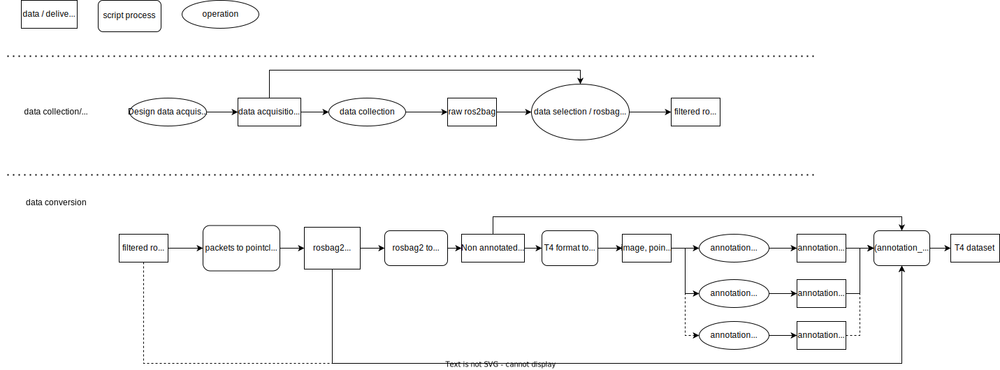

# Tools Overview

This document is simply written about the script.



## Common

Those commands below are asuumed to be run in poetry shell built in [README.md](../README.md)  
Run this to start a poetry shell.

```bash
source /opt/ros/${ROS_DISTRO}/setup.bash
source ${ROS_WORKSPACE_WITH_CUSTOM_MESSAGES}/install/setup.bash
poetry shell
```

## rosbag2 pre-process

The bag of t4_dataset must contain the TOPIC below.
[topics included in t4_dataset bag](t4_format_3d_detailed.md#input-bag)

The topic with a large size output by autoware, such as concatenated/pointcloud, may not be recorded in acquiring the data.
If the required topic is not included in the bag, it is necessary to run the simulator and re-record the bag.

input: rosbag2

output: rosbag2

Case 1: If a map to base_link transform is recorded in /tf topic in the input_bag

```bash
# terminal 1
source ${AUTOWARE_WORKSPACE}/install/setup.bash
ros2 launch autoware_launch logging_simulator.launch.xml map_path:=${MAP_PATH} vehicle_model:=${VEHICLE_MODEL} vehicle_id:=${VEHICLE_ID} sensor_model:=${SENSOR_MODEL} vehicle:=true sensing:=true perception:=false planning:=false control:=false map:=true localization:=false rviz:=true
# terminal 2
# PLAY_RATE example is 0.2. Higher rates may be possible depending on computer processing power. remap recorded /tf
ros2 bag play ${BAG_BEFORE_PROCESSING} --rate ${PLAY_RATE} --clock 200
# terminal 3
ros2 bag record /sensing/camera/camera{CAMERA_ID}/image_rect_color/compressed /sensing/camera/camera{CAMERA_ID}/camera_info /sensing/gnss/{GNSS_VENDOR}/fix_velocity /sensing/gnss/{GNSS_VENDOR}/nav_sat_fix /sensing/gnss/{GNSS_VENDOR}/navpvt /sensing/imu/{IMU_VENDOR}/imu_raw /sensing/lidar/{LIDAR_POSITION}/{LIDAR_VENDOR}_packets /sensing/lidar/concatenated/pointcloud /sensing/radar/{RADAR_POSITION}/objects_raw /{VEHICLE_NAME}/from_can_bus /tf /tf_static /localization/kinematic_state /vehicle/status/velocity_status -o ${BAG_AFTER_PROCESSING} --use-sim-time
```

Case 2:  If a map to base_link transform is `not` recorded in /tf topic recorded in input_bag

```bash
# terminal 1
source ${AUTOWARE_WORKSPACE}/install/setup.bash
ros2 launch autoware_launch logging_simulator.launch.xml map_path:=${MAP_PATH} vehicle_model:=${VEHICLE_MODEL} vehicle_id:=${VEHICLE_ID} sensor_model:=${SENSOR_MODEL} vehicle:=true sensing:=true perception:=false planning:=false control:=false map:=true localization:=true rviz:=true
# terminal 2
# PLAY_RATE example is 0.2. Higher rates may be possible depending on computer processing power. remap recorded /tf
ros2 bag play ${BAG_BEFORE_PROCESSING} --remap /tf:=/unused_tf --rate ${PLAY_RATE} --clock 200
# terminal 3
ros2 bag record /sensing/camera/camera{CAMERA_ID}/image_rect_color/compressed /sensing/camera/camera{CAMERA_ID}/camera_info /sensing/gnss/{GNSS_VENDOR}/fix_velocity /sensing/gnss/{GNSS_VENDOR}/nav_sat_fix /sensing/gnss/{GNSS_VENDOR}/navpvt /sensing/imu/{IMU_VENDOR}/imu_raw /sensing/lidar/{LIDAR_POSITION}/{LIDAR_VENDOR}_packets /sensing/lidar/concatenated/pointcloud /sensing/radar/{RADAR_POSITION}/objects_raw /{VEHICLE_NAME}/from_can_bus /tf /tf_static /localization/kinematic_state /vehicle/status/velocity_status -o ${BAG_AFTER_PROCESSING} --use-sim-time
```

## rosbag2 to T4 non-annotated format data

input: rosbag2

output: T4 non-annotated format data

```bash
python -m perception_dataset.convert --config config/convert_rosbag2_to_non_annotated_t4_sample.yaml
# if you want to overwrite t4-format data, use --overwrite option
```

## Deepen

### T4 format to Deepen format

input: T4 format data

output: deepen-format data

```bash
python -m perception_dataset.convert --config config/convert_t4_to_deepen_sample.yaml
```

### Download Deepen annotations

`DEEPEN_CLIENT_ID` is the `xxx` part of the URL `https://tools.deepen.ai/workspace/xxx/datasets` after logging in to Deepen.
`DEEPEN_ACCESS_TOKEN` can be obtained from [Deepen Tools](https://tools.deepen.ai/workspace/xxx/developer/tokens/developers).

```bash
export DEEPEN_CLIENT_ID='YOUR_DEEPEN_CLIENT_ID'
export DEEPEN_ACCESS_TOKEN='YOUR_DEEPEN_ACCESS_TOKEN'
python -m perception_dataset.deepen.download_annotations --config config/convert_deepen_to_t4_sample.yaml
```

### Deepen format to T4 format

input: T4 non-annotated format data + deepen annotations

output: T4 format data

```bash
python -m perception_dataset.convert --config config/convert_deepen_to_t4_sample.yaml
```

## Rosbag with objects

### Synthetic bag to T4 format

input: rosbag2

output: T4 format data

#### Messages

| Topic Name                                                  | Required | Message Type                                      |
| ----------------------------------------------------------- | -------- | ------------------------------------------------- |
| `/ground_truth/filtered/objects` or `/ground_truth/objects` | o        | `autoware_perception_msgs/msg/DynamicObjectArray` |
| `/sensing/lidar/concatenated/pointcloud`                    | o        | `sensor_msgs/msg/PointCloud2`                     |
| `/tf`                                                       | o        | `tf2_msgs/msg/TFMessage`                          |
| `/tf_static`                                                | o        | `tf2_msgs/msg/TFMessage`                          |
|                                                             |          | `sensor_msgs/msg/CompressedImage`                 |
|                                                             |          | `sensor_msgs/msg/CameraInfo`                      |

#### script

```bash
python -m perception_dataset.convert --config config/rosbag2_to_t4/convert_synthetic_data.yaml
```

### Pseudo-labeled bag to T4 format

input: rosbag2

output: T4 format data

#### Messages

| Topic Name                                                                   | Required | Message Type                                                                                              |
| ---------------------------------------------------------------------------- | -------- | --------------------------------------------------------------------------------------------------------- |
| `/perception/object_recognition/detection/apollo/objects` or other any value | o        | `autoware_auto_perception_msgs/msg/TrackedObjects` or `autoware_auto_perception_msgs/msg/DetectedObjects` |
| `/sensing/lidar/concatenated/pointcloud` or other any value                  | o        | `sensor_msgs/msg/PointCloud2`                                                                             |
| `/tf`                                                                        | o        | `tf2_msgs/msg/TFMessage`                                                                                  |
| `/tf_static`                                                                 | o        | `tf2_msgs/msg/TFMessage`                                                                                  |
| `/sensing/camera/camera{ID}/image_rect_color/compressed`                     |          | `sensor_msgs/msg/CompressedImage`                                                                         |
| `/sensing/camera/camera{ID}/camera_info`                                     |          | `sensor_msgs/msg/CameraInfo`                                                                              |

#### script

```bash
python -m perception_dataset.convert --config config/rosbag2_to_t4/convert_synthetic_data.yaml
```
