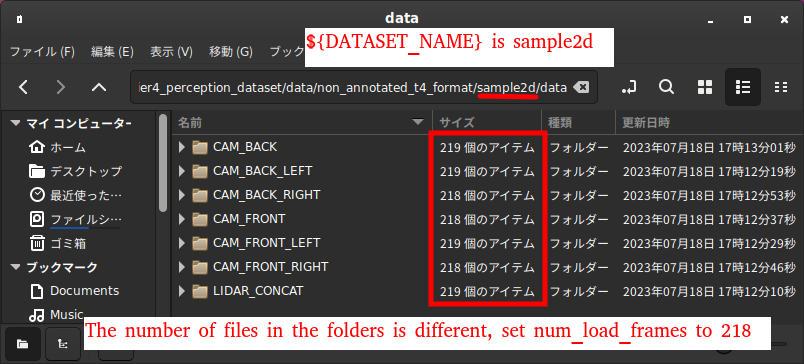

# Tools Overview

This document provides a brief overview of the scripts used in the tier4_perception_dataset.


## Common

The commands below are assumed to be run in the poetry shell, as built in [README.md](../README.md)  
To start a poetry shell, execute the following:

```bash
source /opt/ros/${ROS_DISTRO}/setup.bash
source ${ROS_WORKSPACE_WITH_CUSTOM_MESSAGES}/install/setup.bash
poetry shell
```

## rosbag2 pre-process

The bag of t4_dataset must contain the TOPIC below.
[topics included in t4_dataset bag](t4_format_3d_detailed.md#input-bag)

The topic with a large size output by Autoware, such as concatenated/pointcloud, may not be recorded when acquiring the data.
If the required topic is not included in the bag, it is necessary to run the simulator and re-record the bag.

input: rosbag2  
output: rosbag2

Case 1: If a map to base_link transform is recorded in /tf topic in the input_bag

```bash
# terminal 1
source ${AUTOWARE_WORKSPACE}/install/setup.bash
ros2 launch autoware_launch logging_simulator.launch.xml map_path:=${MAP_PATH} vehicle_model:=${VEHICLE_MODEL} vehicle_id:=${VEHICLE_ID} sensor_model:=${SENSOR_MODEL} vehicle:=true sensing:=true perception:=false planning:=false control:=false map:=true localization:=false rviz:=true
# terminal 2
# PLAY_RATE example is 0.2. Higher rates may be possible depending on computer processing power. remap recorded /tf
ros2 bag play ${BAG_BEFORE_PROCESSING} --rate ${PLAY_RATE} --clock 200
# terminal 3
ros2 bag record /sensing/camera/camera{CAMERA_ID}/image_rect_color/compressed /sensing/camera/camera{CAMERA_ID}/camera_info /sensing/gnss/{GNSS_VENDOR}/fix_velocity /sensing/gnss/{GNSS_VENDOR}/nav_sat_fix /sensing/gnss/{GNSS_VENDOR}/navpvt /sensing/imu/{IMU_VENDOR}/imu_raw /sensing/lidar/{LIDAR_POSITION}/{LIDAR_VENDOR}_packets /sensing/lidar/concatenated/pointcloud /sensing/radar/{RADAR_POSITION}/objects_raw /{VEHICLE_NAME}/from_can_bus /tf /tf_static /localization/kinematic_state /vehicle/status/velocity_status -o ${BAG_AFTER_PROCESSING} --use-sim-time
```

Case 2: If a map to base_link transform is `not` recorded in /tf topic recorded in input_bag

```bash
# terminal 1
source ${AUTOWARE_WORKSPACE}/install/setup.bash
ros2 launch autoware_launch logging_simulator.launch.xml map_path:=${MAP_PATH} vehicle_model:=${VEHICLE_MODEL} vehicle_id:=${VEHICLE_ID} sensor_model:=${SENSOR_MODEL} vehicle:=true sensing:=true perception:=false planning:=false control:=false map:=true localization:=true rviz:=true
# terminal 2
# PLAY_RATE example is 0.2. Higher rates may be possible depending on computer processing power. remap recorded /tf
ros2 bag play ${BAG_BEFORE_PROCESSING} --remap /tf:=/unused_tf --rate ${PLAY_RATE} --clock 200
# terminal 3
ros2 bag record /sensing/camera/camera{CAMERA_ID}/image_rect_color/compressed /sensing/camera/camera{CAMERA_ID}/camera_info /sensing/gnss/{GNSS_VENDOR}/fix_velocity /sensing/gnss/{GNSS_VENDOR}/nav_sat_fix /sensing/gnss/{GNSS_VENDOR}/navpvt /sensing/imu/{IMU_VENDOR}/imu_raw /sensing/lidar/{LIDAR_POSITION}/{LIDAR_VENDOR}_packets /sensing/lidar/concatenated/pointcloud /sensing/radar/{RADAR_POSITION}/objects_raw /{VEHICLE_NAME}/from_can_bus /tf /tf_static /localization/kinematic_state /vehicle/status/velocity_status -o ${BAG_AFTER_PROCESSING} --use-sim-time
```

## rosbag2 to T4 non-annotated format data

This step converts rosbag2 data to `non-annotated` T4 format.

input: rosbag2  
output: T4 non-annotated format data

```bash
python -m perception_dataset.convert --config config/convert_rosbag2_to_non_annotated_t4_sample.yaml
# if you want to overwrite t4-format data, use --overwrite option
```

### confirm non-annotated format data

Verify that the following directories have the same number of files:
`CAM_BACK`, `CAM_BACK_LEFT`, `CAM_BACK_RIGHT`, `CAM_FRONT`, `CAM_FRONT_LEFT`, `CAM_FRONT_RIGHT`, and `LIDAR_CONCAT` in `non_annotated_t4_format/${DATASET_NAME}/data`

If the number of files is different, set the `smallest number` of files to the `num_load_frames` in `config/convert_rosbag2_to_non_annotated_t4.yaml`.
Execute the conversion command again with `--overwrite` option.



## Deepen

### Non-annotated T4 format to Deepen format

Converts T4 format data to Deepen format.

input: Non-annotated T4 format data  
output: deepen-format data

```bash
python -m perception_dataset.convert --config config/convert_non_annotated_t4_to_deepen_sample.yaml
```

### Create and update dataset

Login to deepen, create a dataset, and upload the file `deepen_format/${DATSET_NAME}.zip`

Please refer to [the help page](https://help.deepen.ai/deepen-ai-enterprise/data-management/project-setup-and-data-import)

#### Create dataset profile

Set the categories for t4_dataset.
Please refer to [the help page](https://help.deepen.ai/deepen-ai-enterprise/data-management/adding-categories-and-attributes).

Add the items listed in Items in [category.json](t4_format_3d_detailed.md#categoryjson)
Once you have created a profile, you can just import the profile next time.

### Annotate with Deepen

Annotate with deepen.
Please refer to [the help page](https://help.deepen.ai/deepen-ai-enterprise/data-management/adding-categories-and-attributes) for operating instructions.

When the work is finished, click `Mark dataset as done` in Datasets / Dataset Details page.

### Download Deepen annotations

`DEEPEN_CLIENT_ID` is the `xxx` part of the URL `https://tools.deepen.ai/workspace/xxx/datasets` after logging in to Deepen.
`DEEPEN_ACCESS_TOKEN` can be obtained from [Deepen Tools](https://tools.deepen.ai/workspace/xxx/developer/tokens/developers).

```bash
export DEEPEN_CLIENT_ID='YOUR_DEEPEN_CLIENT_ID'
export DEEPEN_ACCESS_TOKEN='YOUR_DEEPEN_ACCESS_TOKEN'
python -m perception_dataset.deepen.download_annotations --config config/convert_deepen_to_t4_sample.yaml
```

### Deepen format to T4 format

input: T4 non-annotated format data + deepen annotations  
output: T4 format data

```bash
python -m perception_dataset.convert --config config/convert_deepen_to_t4_sample.yaml
```

## FastLabel

This step converts FastLabel 2D annotations to T4 format (2D only).

### Conversion from FastLabel JSON Format to T4 Format

input: T4 format data (3D annotated or non-annotated) + FastLabel annotations (JSON format)  
output: T4 format data (2D annotated)

```bash
python -m perception_dataset.convert --config config/convert_fastlabel_2d_to_t4.yaml
# To overwrite T4-format data, use the --overwrite option
```

## Rosbag with objects

### Synthetic bag to T4 format

input: rosbag2  
output: T4 format data

### Description

This function is for converting a synthetic bag to T4 format.
Synthetic bag must contain ground truth objects, pointclouds and tf.
`ground_truth/objects` can be either `autoware_auto_perception_msgs/msg/DetectedObjects` or `autoware_auto_perception_msgs/msg/TrackedObjects`.

#### Messages

| Topic Name                                                  | Required | Message Type                                        |
| ----------------------------------------------------------- | -------- | --------------------------------------------------- |
| `/ground_truth/filtered/objects` or `/ground_truth/objects` | o        | `autoware_auto_perception_msgs/msg/DetectedObjects` |
| `/sensing/lidar/concatenated/pointcloud`                    | o        | `sensor_msgs/msg/PointCloud2`                       |
| `/tf`                                                       | o        | `tf2_msgs/msg/TFMessage`                            |
| `/tf_static`                                                | o        | `tf2_msgs/msg/TFMessage`                            |
|                                                             |          | `sensor_msgs/msg/CompressedImage`                   |
|                                                             |          | `sensor_msgs/msg/CameraInfo`                        |

#### script

```bash
python -m perception_dataset.convert --config config/rosbag2_to_t4/convert_synthetic_data.yaml
```

### Synthetic bag to T4 format with images and 2d images annotations

input: rosbag2  
output: T4 format data

#### Messages

| Topic Name                                    | Required | Message Type                                       |
| --------------------------------------------- | -------- | -------------------------------------------------- |
| `/ground_truth/objects`                       | o        | `autoware_auto_perception_msgs/msg/TrackedObjects` |
| `/sensing/camera/camera{ID}/camera_info`      | o        | `visualization_msgs/msg/MarkerArray`               |
| `/sensing/lidar/concatenated/pointcloud`      | o        | `sensor_msgs/msg/PointCloud2`                      |
| `/tf`                                         | o        | `tf2_msgs/msg/TFMessage`                           |
| `/tf_static`                                  | o        | `tf2_msgs/msg/TFMessage`                           |
| `/sensing/camera/camera{ID}/image_rect_color` | o        | `sensor_msgs/msg/Image`                            |
| `/sensing/camera/camera{ID}/camera_info`      | o        | `sensor_msgs/msg/CameraInfo`                       |

#### script

```bash
python -m perception_dataset.convert --config config/rosbag2_to_t4/convert_synthetic_data_camera.yaml --synthetic --generate-bbox-from-cuboid
```

### Pseudo-labeled bag to T4 format

#### Description

This function is for converting a pseudo-labeled bag to T4 format.  
The pseudo-labeled bag contains either detection output or tracking output from Autoware. The detection output is a message of `autoware_auto_perception_msgs/msg/DetectedObjects`, and the tracking output is a message of `autoware_auto_perception_msgs/msg/TrackedObjects`.

input: rosbag2  
output: T4 format data

#### Messages

| Topic Name                                                                                                                 | Required | Message Type                                                                                              |
| -------------------------------------------------------------------------------------------------------------------------- | -------- | --------------------------------------------------------------------------------------------------------- |
| `/perception/object_recognition/detection/objects` or `/perception/object_recognition/tracking/objects` or other any value | o        | `autoware_auto_perception_msgs/msg/TrackedObjects` or `autoware_auto_perception_msgs/msg/DetectedObjects` |
| `/sensing/lidar/concatenated/pointcloud` or other any value                                                                | o        | `sensor_msgs/msg/PointCloud2`                                                                             |
| `/tf`                                                                                                                      | o        | `tf2_msgs/msg/TFMessage`                                                                                  |
| `/tf_static`                                                                                                               | o        | `tf2_msgs/msg/TFMessage`                                                                                  |
| `/sensing/camera/camera{ID}/image_rect_color/compressed`                                                                   |          | `sensor_msgs/msg/CompressedImage`                                                                         |
| `/sensing/camera/camera{ID}/camera_info`                                                                                   |          | `sensor_msgs/msg/CameraInfo`                                                                              |

#### script

```bash
python -m perception_dataset.convert --config config/rosbag2_to_t4/convert_pseudolabel_lidar.yaml
```

### Annotated T4 format to Deepen format

In case you may want to modify the annotation of the T4 format data, you can also convert the annotated T4 format data to Deepen format.
NOTE: By default the conversion script will convert sensor data and annotation data, but you may change `label_only` to `true` in the config file to convert only the annotation data.

input: Annotated T4 format data
output: deepen-format data (sensor data and label data)

```bash
python -m perception_dataset.convert --config config/convert_annotated_t4_to_deepen_sample.yaml
```
